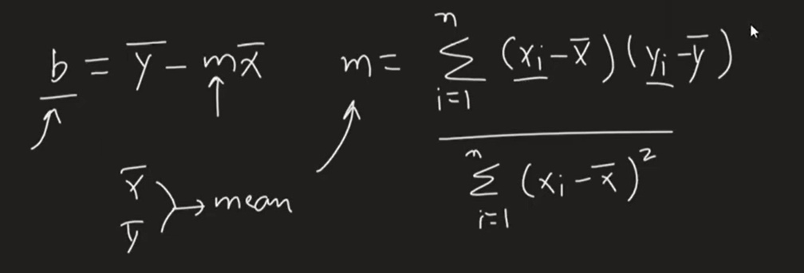
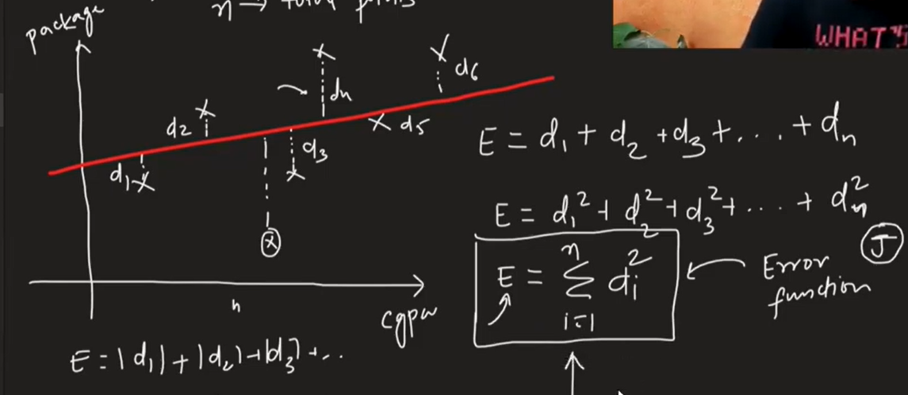
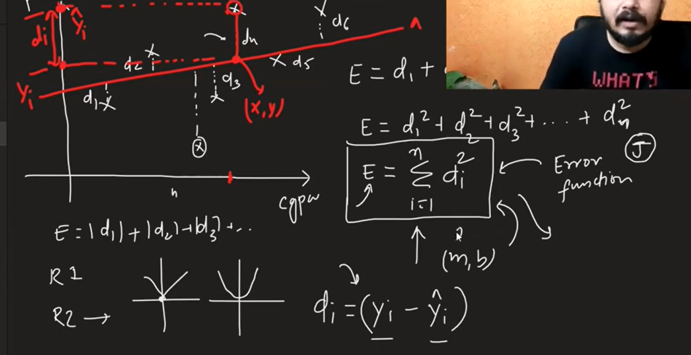
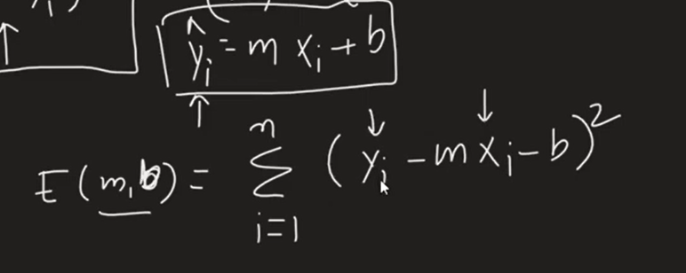
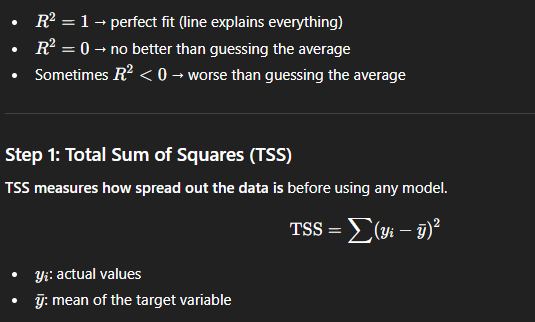
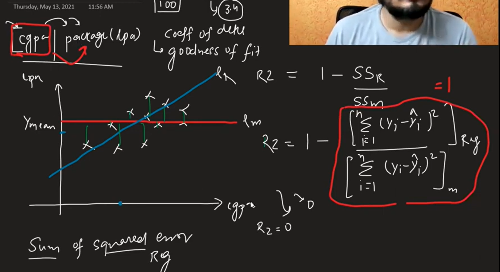
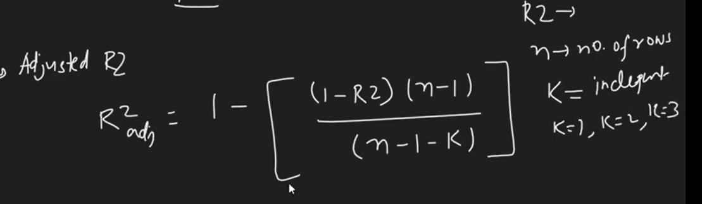
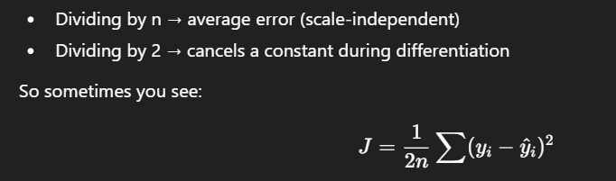
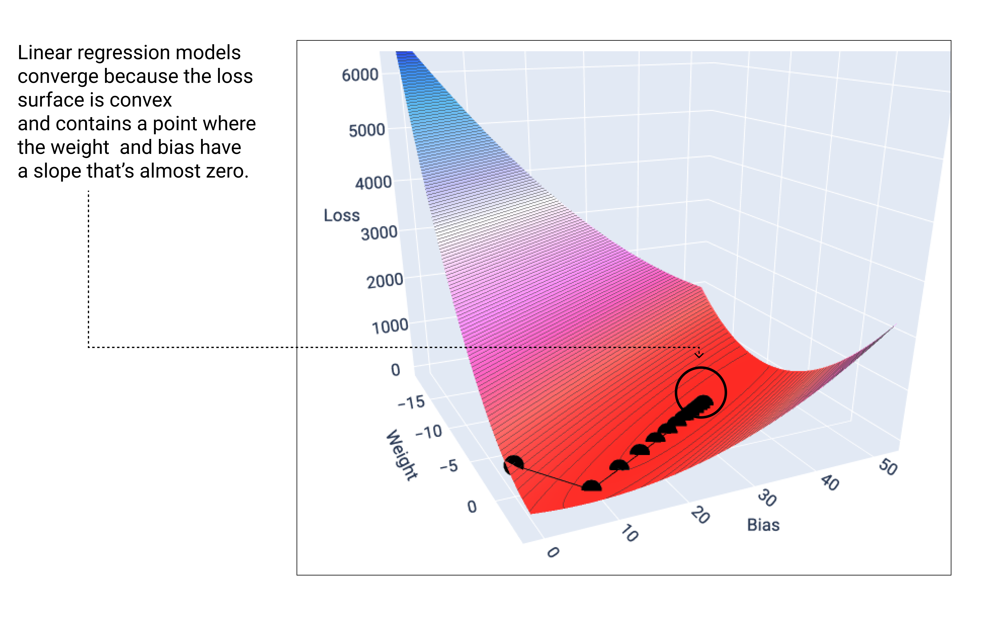

Machine learning is a field of computer science that
uses statistical techniques to give computer systems
the ability to "learn" with data, without being
explicitly programmed.

# Supervise Machine Learning
*   Types
    *   **Regression :** It is used when the target/output column is numerical
    *   **Classification :** It is used when the output column is categorical
*   **Unsupervised Machine:**
    *   In Unsupervised ML you only have input
    *   Types : 
        *   **Clustering :** It detects that particulard data will fall in which group or category. 
        
        *   **Dimensionality Reduction :** When you are working with supervised ML you have too many input columns. it makes algo slow and it does not improve result because there are some columns that do not help in predicting. It is done using techniques like **PCA** .

        Also it is used in visualisation technique. Sometimes we cannot visualise a data because it is high dimensional data so we can plot it. so we use dimensionality redution to reduce dimension and then plot it E.g : MNIST Dataset

        *   **Anomaly Detection :** It is used in detecting anomaly detection like detecting in manufacturing or credit card fraud detection so it basically detect outliers.

        *   **Association rule learning :** Association Rule Learning is an unsupervised machine learning technique used to discover hidden relationships (patterns) between items in large datasets.For example it can be used in super market to find relationship between products and using that we can create combo offers.
*   **Semi Supervised :** It is partially unsupervised and partially supervised.It has small amount of labelled data and large amount of unlabeled data. Labelling data is expensive, slow and requires experts.

*   **Reinforcement Learning :** 
    *   Reinforcement Learning (RL) is a type of machine learning where an agent learns to make decisions by interacting with an environment to maximize cumulative rewards. The goal is to learn a policy that maximizes long-term reward.

**Instance-based learning (memory-based / lazy learning) :** Learns by remembering instances. E.g. : K nearest neighbors

**Model-based learning (eager learning) :** The algorithm builds an explicit model that.

# **Simple Linear Regression**

Simple linear regression (SLR) is a fundamental supervised learning statistical method used to model the relationship between two variables: one independent variable and one dependent variable.
## Types
* Simple Linear Regression
* Multiple Linear Regression
* Polynomail Linear Regression : It is used when our data is not linear

### Simple Linear Regression

* What is best fit line : It is the line that minimizes errors across all data points according to chosen rules. That rule will be mean squared error.
* Intercept (β₀) : Expected value of y when X = 0
* β₁ : On average, how much does y change when X increases by 1 unit?”

The model never predicts ε.

* There are 2 ways to find the value of m and b.
  * **Closed form solution** :  (Direct mathematical formula using ordinary least square. Scikit learn is using this technique for linear regression algo).
  * Its only efficient for lower dimensional data.

  
  * **Non closed form solution** (Gradient Descent). Used for higher dimensional data. SGD Regressor in python uses this.
  
  #### Regression evaluation metrics
  * MAE (L1 Regression) : $\frac{1}{n}\sum_{i=1}^{n}\left|y_i-\hat{y}_i\right|$

  Advantages: It is differentiable
  Disadvantages: Not robust to outliers.

  * MSE : $\frac{1}{n}\sum_{i=1}^{n}\left(y_i-\hat{y}_i\right)^2$

  Advantages: Robuts to outliers.
  Disadvantages:
    It is not differentiable at 0.

   
  * RMSE : $\sqrt{\frac{1}{n}\sum_{i=1}^{n}\left(y_i-\hat{y}_i\right)^2}$

  * R2 Score : $1-\frac{\sum_{i=1}^{n}\left(y_i-\hat{y}_i\right)^2}{\sum_{i=1}^{n}\left(y_i-\bar{y}\right)^2}$

  R² compares your model against a dumb model that always predicts mean(y).

  
 

 

Problem: R² never decreases when you add more features (predictors), even if those features are useless.

  * Adjusted R2 score : It rewards you for adding useful features and punishes you for adding useless ones.
  

Shape of the cost function creates a bowl shaped curve having a single global minimum.

### Multi Linear Regression

**New Topics :**
  * Out of core learning : Out-of-core learning is a machine learning approach designed to handle datasets that are too large to fit into a computer’s main memory (RAM). Instead of loading the entire dataset at once, the algorithm processes the data in small chunks. E.g Mini batch processing, Stochastic gradient descent.

  
