Machine learning is a field of computer science that
uses statistical techniques to give computer systems
the ability to "learn" with data, without being
explicitly programmed.

## **Supervise Machine Learning**

* Types
  * **Regression :** It is used when the target/output column is numerical
  * **Classification :** It is used when the output column is categorical

## **Unsupervised Machine:**

* In Unsupervised ML you only have input
* Types :
  * **Clustering :** It detects that particulard data will fall in which group or category.

  * **Dimensionality Reduction :** When you are working with supervised ML you have too many input columns. it makes algo slow and it does not improve result because there are some columns that do not help in predicting. It is done using techniques like **PCA** .

        Also it is used in visualisation technique. Sometimes we cannot visualise a data because it is high dimensional data so we can plot it. so we use dimensionality redution to reduce dimension and then plot it E.g : MNIST Dataset

  * **Anomaly Detection :** It is used in detecting anomaly detection like detecting in manufacturing or credit card fraud detection so it basically detect outliers.

  * **Association rule learning :** Association Rule Learning is an unsupervised machine learning technique used to discover hidden relationships (patterns) between items in large datasets.For example it can be used in super market to find relationship between products and using that we can create combo offers.

## **Semi Supervised**

* It is partially unsupervised and partially supervised.It has small amount of labelled data and large amount of unlabeled data. Labelling data is expensive, slow and requires experts

## **Reinforcement Learning**

* Reinforcement Learning (RL) is a type of machine learning where an agent learns to make decisions by interacting with an environment to maximize cumulative rewards. The goal is to learn a policy that maximizes long-term reward.

## Extra Information

**Instance-based learning (memory-based / lazy learning) :** Learns by remembering instances. E.g. : K nearest neighbors

**Model-based learning (eager learning) :** The algorithm builds an explicit model that.

# **Simple Linear Regression**

Simple linear regression (SLR) is a fundamental supervised learning statistical method used to model the relationship between two variables: one independent variable and one dependent variable.

## Types

* Simple Linear Regression
* Multiple Linear Regression
* Polynomail Linear Regression : It is used when our data is not linear

### Simple Linear Regression

* What is best fit line : It is the line that minimizes errors across all data points according to chosen rules. That rule will be mean squared error.
* Intercept (β₀) : Expected value of y when X = 0
* β₁ : On average, how much does y change when X increases by 1 unit?”

The model never predicts ε.

* There are 2 ways to find the value of m and b.
  * **Closed form solution** :  (Direct mathematical formula using ordinary least square. Scikit learn is using this technique for linear regression algo).
  * Its only efficient for lower dimensional data. If a function is convex that means if the line between any two points on the function lies above the function having one one global minima or maxima then we can use closed form solution.

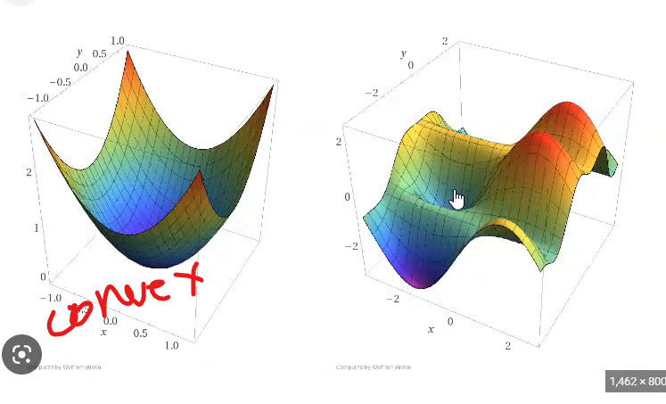

* **Non closed form solution** (Gradient Descent). Used for higher dimensional data. SGD Regressor in python uses this.
  
#### Regression evaluation metrics

* MAE (L1 Regression) : $\frac{1}{n}\sum_{i=1}^{n}\left|y_i-\hat{y}_i\right|$

  Advantages: Robuts to outliers.
  Disadvantages: It is not differentiable at 0.

* MSE : $\frac{1}{n}\sum_{i=1}^{n}\left(y_i-\hat{y}_i\right)^2$

  Advantages: It is differentiable
  Disadvantages: Not robust to outliers.

* RMSE : $\sqrt{\frac{1}{n}\sum_{i=1}^{n}\left(y_i-\hat{y}_i\right)^2}$

* R2 Score : $1-\frac{\sum_{i=1}^{n}\left(y_i-\hat{y}_i\right)^2}{\sum_{i=1}^{n}\left(y_i-\bar{y}\right)^2}$

  R² compares your model against a dumb model that always predicts mean(y).

 

 

Problem: R² never decreases when you add more features (predictors), even if those features are useless.

* Adjusted R2 score : It rewards you for adding useful features and punishes you for adding useless ones.
  

Shape of the cost function creates a bowl shaped curve having a single global minimum.

## Multi Linear Regression

* It is an extension of simple linear regression that uses multiple independent variables to predict the value of a dependent variable.
* The model is represented as: y = β₀ + β₁x₁ + β₂x₂ + ... + βₙxₙ
* In simple linear regression, we try to find the best-fit line because the relationship involves one independent variable and one dependent variable, which can be represented in a 2-dimensional plane. In multiple linear regression, we try to find the best-fit hyperplane because the relationship involves multiple independent variables, and the data exists in a higher-dimensional space (e.g., 3D or more).

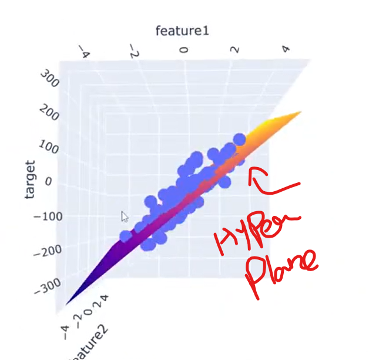

* Formula for predicting value of y using matrix representation:

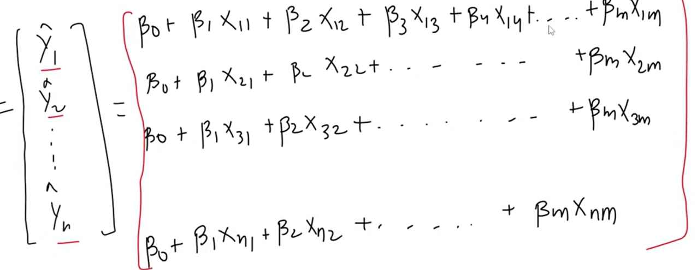

* This matrix can be decomposed to 2 matrices X and β where X is feature matrix and β is coefficient matrix. Dot product of these 2 matrices will give predicted value of y.

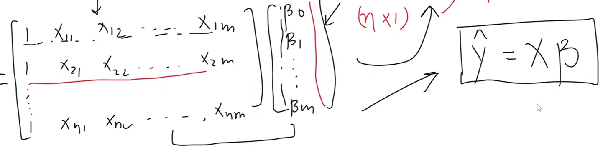
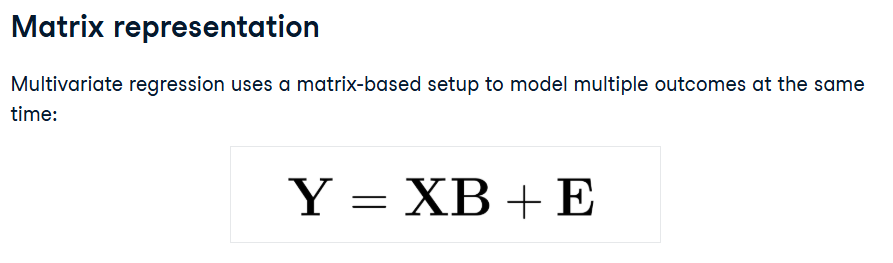
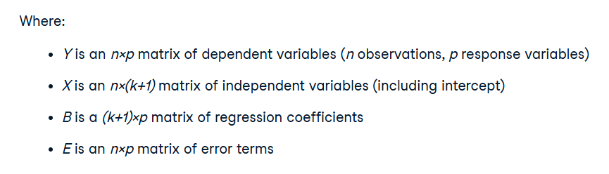

* The shape of X will be (m,n+1) where m is number of training examples and n is number of features. And shape of β will be (n+1,1) because we have n features and each feature will have one coefficient. So the shape of predicted y will be (m,1) because we have m training examples. its n+1 because of intercept term.
* cost function for multiple linear regression is as follows:

In Multiple Linear Regression (MLR), the key idea behind **Ordinary Least Squares (OLS)** is:

> Choose coefficients \(\beta\) such that the **Sum of Squared Errors (SSE)** is minimized.

---

## 1) Core objects in Multiple Linear Regression

The MLR model is:

$$
y = X\beta + \varepsilon
$$

Where:

### 1.1 Output vector \(y\) (n×1)

\(y\) contains all actual target values:

$$
y=
\begin{bmatrix}
y_1\\
y_2\\
\vdots\\
y_n
\end{bmatrix}
$$

* \(n\) = number of training examples

---

### 1.2 Feature matrix \(X\) (n×p)

\(X\) stores all feature values.

* \(n\) = number of samples (rows)
* \(p\) = number of parameters (columns)  
  (including intercept column of ones)

Example: intercept + two features \((x_1, x_2)\)

$$
X=
\begin{bmatrix}
1 & x_{11} & x_{12}\\
1 & x_{21} & x_{22}\\
\vdots & \vdots & \vdots\\
1 & x_{n1} & x_{n2}
\end{bmatrix}
$$

---

### 1.3 Coefficient vector \(\beta\) (p×1)

$$
\beta=
\begin{bmatrix}
\beta_0\\
\beta_1\\
\beta_2
\end{bmatrix}
$$

* $$\beta_0\ = intercept $$
* $$\beta_1,\beta_2,\dots\ = weights of features $$

---

### 1.4 Predicted values \(\hat{y}\) (n×1)

$$
\hat{y}=X\hat{\beta}
$$

Which means:

$$
\hat{y}=
\begin{bmatrix}
\hat{y}_1\\
\hat{y}_2\\
\vdots\\
\hat{y}_n
\end{bmatrix}
$$

---

### 1.5 Residual (error) vector \(e\) (n×1)

Residuals are the difference between actual and predicted values:

$$
e = y-\hat{y}
$$

So:

$$
e=
\begin{bmatrix}
y_1-\hat{y}_1\\
y_2-\hat{y}_2\\
\vdots\\
y_n-\hat{y}_n
\end{bmatrix}
$$

Each residual value:

$$
e_i=y_i-\hat{y}_i
$$

---

### Residual transpose vector \(e^T\) is (1×n)

$$
e^T=
\begin{bmatrix}
y_1-\hat{y}_1 & y_2-\hat{y}_2 & \cdots & y_n-\hat{y}_n
\end{bmatrix}
$$

### Residual vector \(e\) is (n×1)

$$
e=
\begin{bmatrix}
y_1-\hat{y}_1\\
y_2-\hat{y}_2\\
\vdots\\
y_n-\hat{y}_n
\end{bmatrix}
$$

Now multiply them:

$$
e^T e=
\begin{bmatrix}
y_1-\hat{y}_1 & y_2-\hat{y}_2 & \cdots & y_n-\hat{y}_n
\end{bmatrix}
\begin{bmatrix}
y_1-\hat{y}_1\\
y_2-\hat{y}_2\\
\vdots\\
y_n-\hat{y}_n
\end{bmatrix}
$$

Result is:

$$
e^Te=(y_1-\hat{y}_1)^2+(y_2-\hat{y}_2)^2+\cdots+(y_n-\hat{y}_n)^2
$$
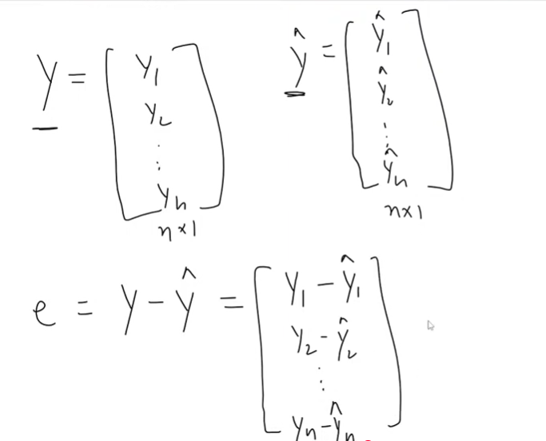
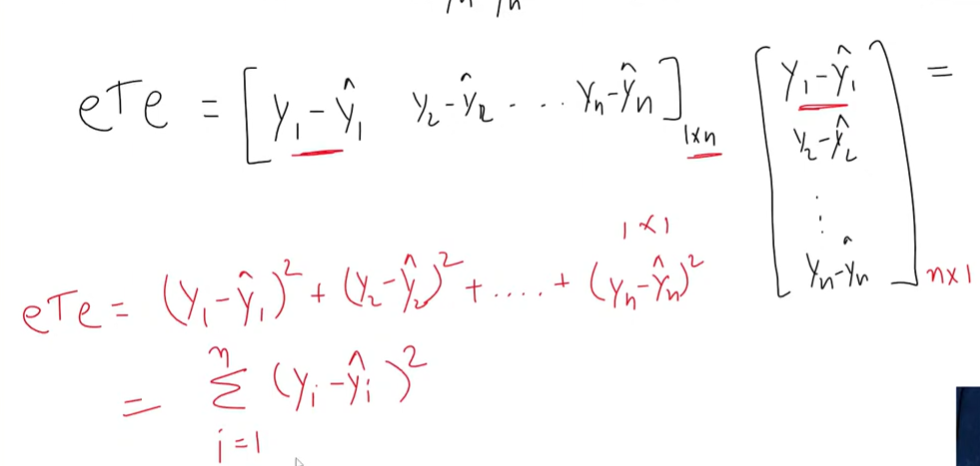

✅ This is exactly the **Sum of Squared Errors (SSE)**.

---

## 3) Interpretation: What is SSE?

### ✅ SSE / RSS Meaning

\(e^T e\) is known as:

* SSE = Sum of Squared Errors
* RSS = Residual Sum of Squares
* Sum of Squared Residuals

It measures the **total squared prediction error** of the model on the dataset.

If SSE is small → predictions are close to actual values.  
If SSE is large → model predictions are far from actual values.

---

## 4) Why do we square the residuals?

For a sample:

$$
e_i = y_i - \hat{y}_i
$$

If we just summed residuals:

$$
\sum_{i=1}^{n} e_i
$$

Problems occur:

* positive and negative errors cancel out
* model may look “perfect” even when it isn’t

Example: errors \(+10\) and \(-10\)

$$
+10 + (-10) = 0
$$

So we square them:

$$
\sum_{i=1}^{n} e_i^2
$$

Benefits of squaring:

* makes all errors positive
* penalizes large errors heavily
* gives a smooth differentiable objective (easy optimization)

---

## 5) The OLS objective in matrix form

Since:

$$
e=y-X\beta
$$

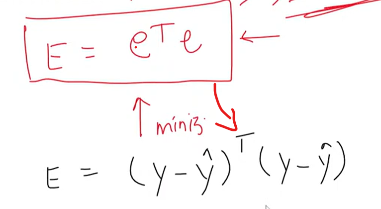
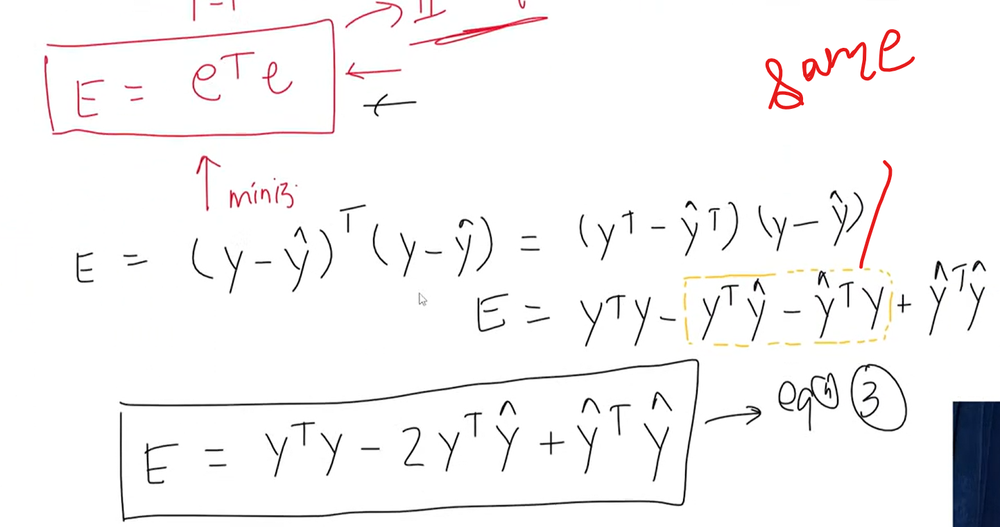
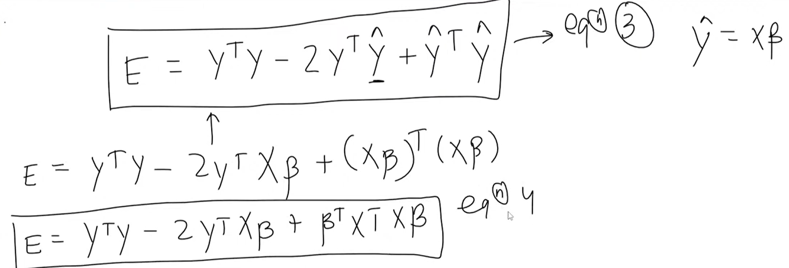

_****------------------------------------****_

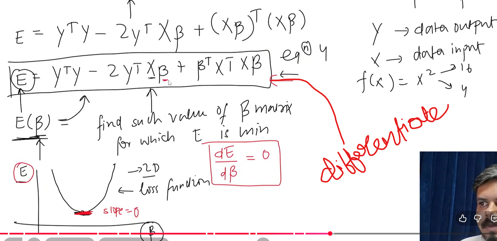

We will differentiate the equation shown in the image to find the best value of beta which minimizes the error. The equation after performing differentiation is shown below:

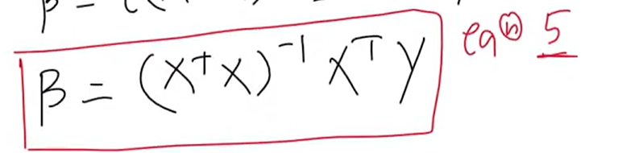

The shape of β will be (m+1,1) because we have m features and one intercept term.

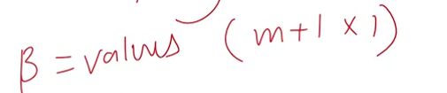

$
e^Te = (y-X\beta)^T(y-X\beta)
$

---

## 6) Expanding the objective

Expanding:

$$
(y-X\beta)^T(y-X\beta)
$$

gives:

$$
(y-X\beta)^T(y-X\beta)
=
y^Ty - 2\beta^T X^T y + \beta^T X^T X \beta
$$

## 7) Minimization leads to Normal Equation

We minimize SSE by differentiating with respect to \(\beta\) and setting gradient to 0.

Result:

$$
X^T X \beta = X^T y
$$

This is the **Normal Equation**.

Solving for \(\beta\):

$$
\hat{\beta} = (X^T X)^{-1}X^T y
$$

This is the **closed-form OLS solution** (works if \(X^TX\) is invertible).

---

## 8) Geometric intuition (very important)

* \(y\) is a vector in \(n\)-dimensional space
* \(\hat{y}\) lies in the column space (span) of \(X\)

OLS chooses \(\hat{y}\) to be the **projection of \(y\)** onto the space spanned by columns of \(X\).

Residual:

$$
e = y - \hat{y}
$$

OLS ensures residual is perpendicular to the feature space:

$$
X^T e = 0
$$

Substitute \(e=y-X\beta\):

$$
X^T(y-X\beta)=0
$$

Which becomes:

$$
X^T X\beta = X^T y
$$

So the normal equation is actually a **perpendicularity condition**:
> error must be orthogonal to the space of predictors.

---

**Feature Scaling (Important for feature engineering):**

* Feature scaling are mainly of 2 types which are as folloews:
  * **Normalization**
    * Normalization is a data preprocessing technique that rescales numerical features to a common range, most commonly between 0 and 1, so that all features are on the same scale and differences in measurement units are eliminated.
    * It is not robuts to outliers because if there is an outlier then min and max value will be affected and all other values will be compressed in small range.
    * It is not necessary that the distribution shape will remain same after normalization.
    * Types of normalization :
      * **Min Max Scaling:** It scales the data to a fixed range, usually 0 to 1. It is mostly used in image processing where pixel values are between 0 to 255 because we know the maximum and minimum values and we want to scale it between 0 and 1.
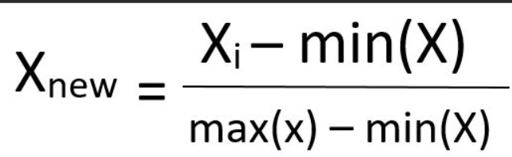
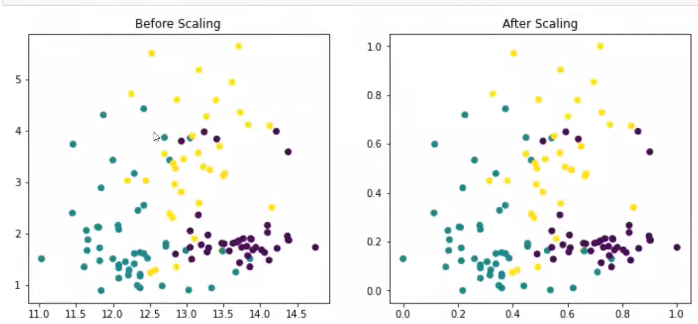
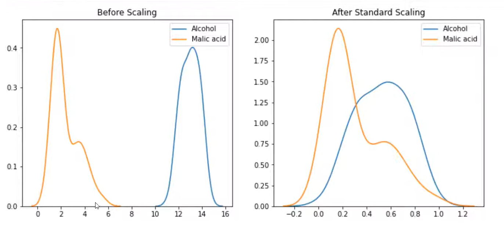
      * As you can see that both these distribution first were not overlapping because of different scale but after min max scaling both are overlapping because both are in same scale now.

      * **Max Abs Scaling** : It scales the data by dividing each value by the maximum absolute value of that feature. The resulting values will be in the range [-1, 1]. It is mostly used when data is sparse where significant portion of the values are zero.
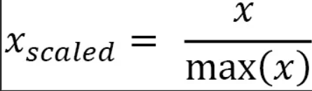
      * **Mean Normalization :** It is a technique used to scale features by subtracting the mean and dividing by the range (max - min) of the feature. This centers the data around zero and scales it to a range of -1 to 1.
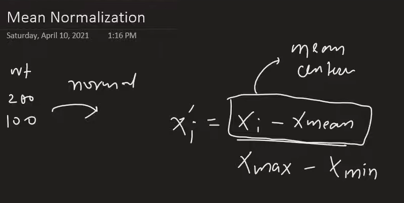
      * Robust Scaling : It is used when data contains outliers. It uses median and interquartile range for scaling. It subtracts median from each value and then divides it by interquartile range.
  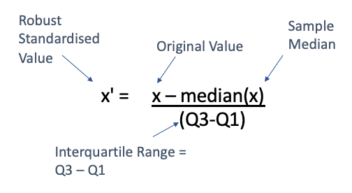
  * **Standardization**
    * It is used when we know the distribution of data. It scales data such that mean becomes 0 and standard deviation becomes 1. It is based on z score and thats why it is also called z score normalization.
    * Z-score normalization (also called standardization) is the process of transforming every value in a feature into its z-score.
    * Shape of distribution does not change after standardization.
    * Standardization (z-score normalization) involves mean centering followed by scaling by the standard deviation. This transformation results in a feature with zero mean and unit variance, effectively rescaling the data without changing its distribution shape.
    * If we standardize the data then we can easily find outliers because outliers will have z score greater than 3 or less than -3.
    * Algorithms like decision tree, random forest do not require feature scaling because they are not based on distance.
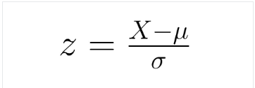
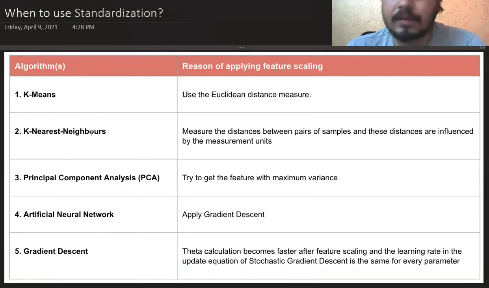
* The main reason to do feature scaling is that some machine learning algorithms use distance between data points to make predictions. If one feature has a wide range of values, it can dominate the distance calculations and lead to biased results. By scaling features to a similar range, we ensure that all features contribute equally to the distance calculations.

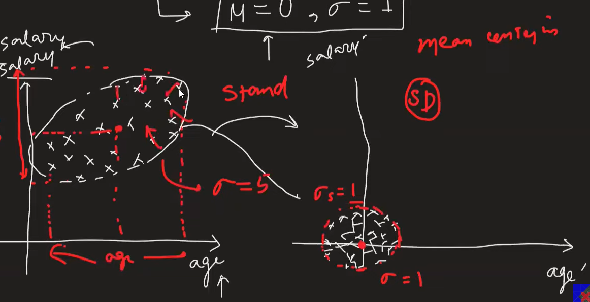

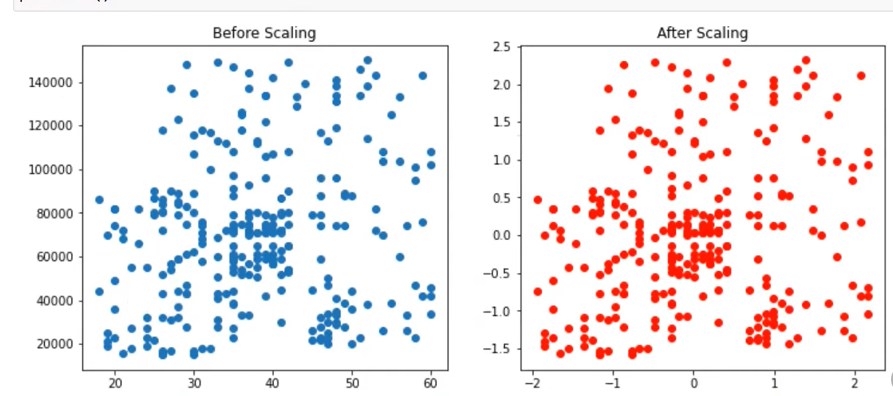

**Feature Encoding (Important for feature engineering):**

## Loss Functions

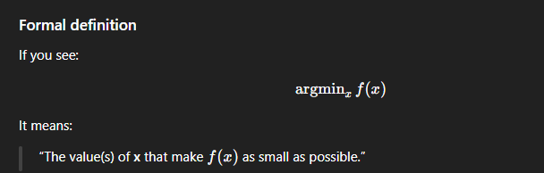
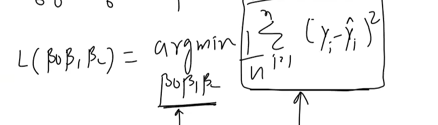

## Gradient Descent

Problems faced in Gradient Descent:
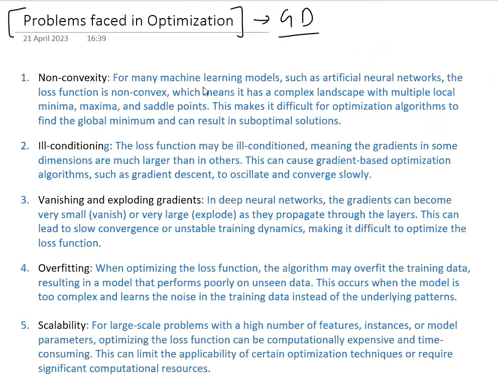
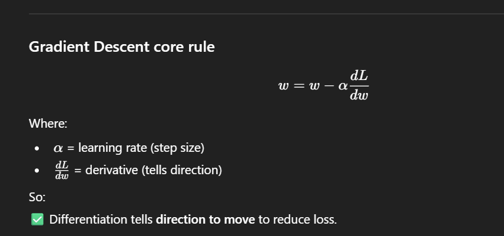

Gradient descent baiscally helps us to find the minima of a function. It is an optimization algorithm used to minimize a function by iteratively moving towards the steepest descent, which is the direction of the negative gradient.

Step 1 : Initialize the parameters (weights) randomly or with some initial values.

Step 2 : Calculate the predicted output using current parameters.

Step 3 : Compute the loss (error) between predicted output and actual output using a loss function.

Step 4: Calculate the gradient of the loss function with respect to each parameter. The gradient represents the direction and rate of change of the loss function. It is computed using derivatives. If the gradient of a parameter is positive, increasing that parameter increases the loss, so the parameter value is decreased. If the gradient is negative, increasing the parameter decreases the loss, so the parameter value is increased. In this way, the parameters are adjusted in the direction opposite to the gradient to move toward the minimum of the loss function.

Step 5: Update the parameters using the calculated gradients and a learning rate, which determines the step size for each update. The learning rate is a hyperparameter that needs to be chosen carefully; too large a learning rate can cause overshooting of the minimum, while too small a learning rate can lead to slow convergence. So updated parameter = current parameter - learning rate * gradient(slope).

Step 6: Repeat steps 2 to 5 until convergence, which occurs when the change in loss is below a certain threshold or after a fixed number of iterations.

--------------------------------------------------------

For L(m,b) first we will calculate partial derivative with respect to m and b.

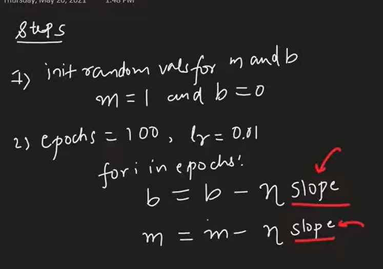

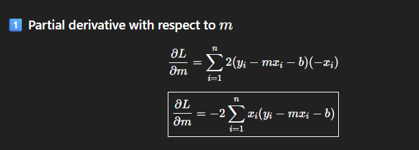

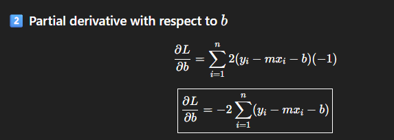

Types of Gradient Descent:

* **Batch Gradient Descent** : It uses the entire dataset to compute the gradient of the loss function for each iteration. It provides a stable and accurate estimate of the gradient but can be computationally expensive for large datasets. It is mainly used when the dataset is small enough to fit into memory and also converges smoothly towards the minimum of the loss function. Convex functions are best suited for batch gradient descent because BGD can get stuck in local minima or saddle points in non convex function.
* **Stochastic Gradient Descent :** It updates the parameters using the gradient computed from a single randomly selected data point. This makes it much faster and allows it to start improving the model right away. However, the updates can be noisy and may lead to a less stable convergence. Its name is stochastic because of the randomness involved in selecting data points for each update.
* The final solution may oscillate around the minimum rather than converging smoothly because of randomness in selecting data points for each update.
* In stochastic it is possible that **step n+1 is worse than step n because of randomness.** while in batch it is not possible because it uses entire data.
* In SGD we can face a problem wherein even near the solution the updates can be large and erratic because of high variance in gradient estimates from single data points. To mitigate this, techniques like learning rate scheduling (gradually decreasing the learning rate over time) and data shuffling (randomizing the order of data points before each epoch) are commonly used.

* Advantages of stochastic gradient descent include faster convergence, ability to escape local minima, and suitability for large datasets. It is mainly used when the dataset is too large to fit into memory or when we want to quickly iterate over the data. Non-convex functions are best suited for stochastic gradient descent.
* Gradient estimates in stochastic gradient descent are noisy, leading to oscillations around the minimum; requires careful learning rate scheduling and data shuffling.
* SGD’s noise can actually help escape saddle points and poor local minima. Deep learning is non-convex + large-scale and that's why SGD practical and effectively always used to train deep learning models.

* **Why SGD uses random rows (not sequential)**

* SGD updates model parameters using one random data row (or sequential rows after shuffling) because:

* Prevents ordering bias: real datasets are often sorted/grouped (by class, time, category). Sequential updates can make SGD learn in a biased direction.

* Reduces correlated gradients: consecutive rows are similar → gradients become similar → slow/unstable learning. Randomization breaks this correlation.

* Unbiased gradient estimate: random sampling ensures the expected SGD gradient points toward the true/full gradient direction.

* **Mini-Batch Gradient Descent :** It is a compromise between batch and stochastic gradient descent. It divides the dataset into small batches and computes the gradient for each batch. This approach balances the computational efficiency of stochastic gradient descent with the stability of batch gradient descent.

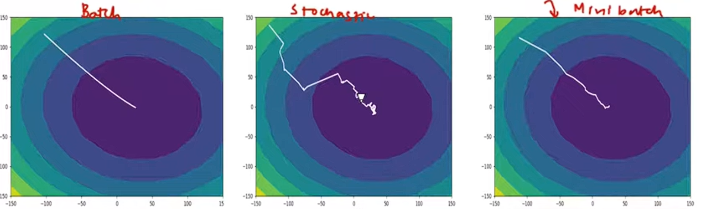

## Gradient Descent for n dimensional data

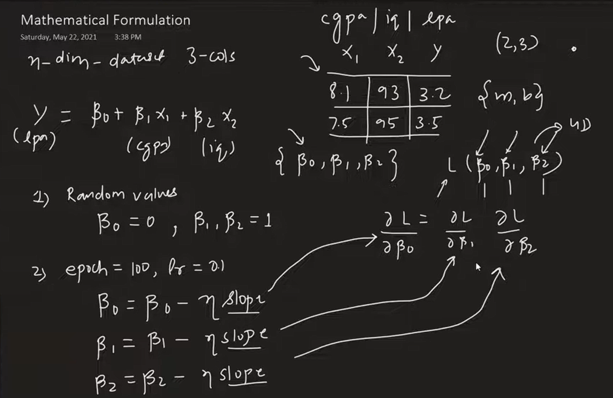
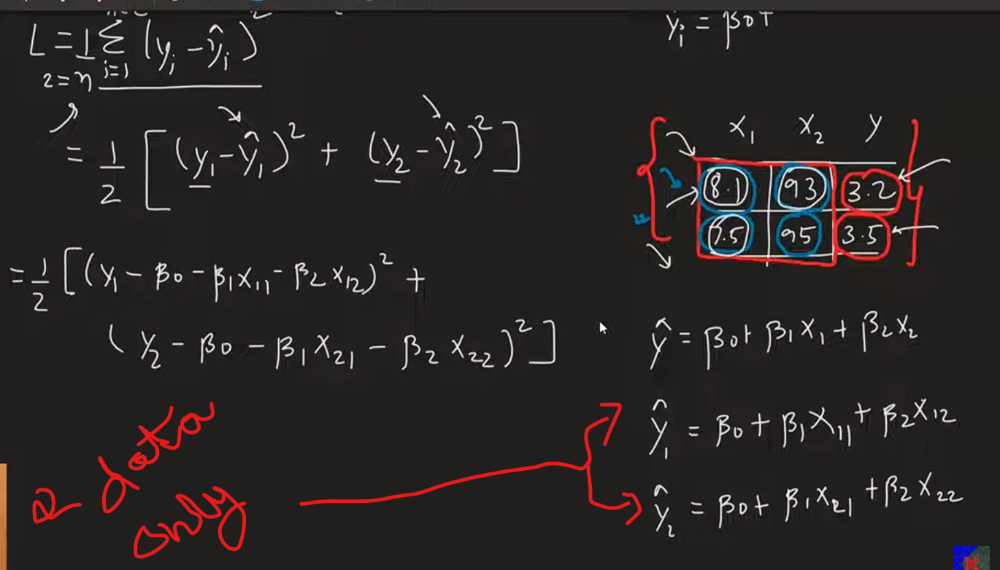

Partial derivative with respect to ${\beta_0}$

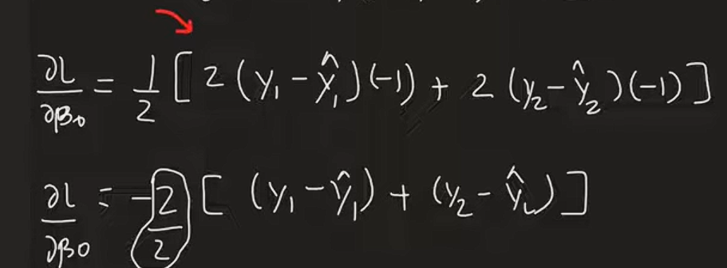

Now generalising the method for n dimension

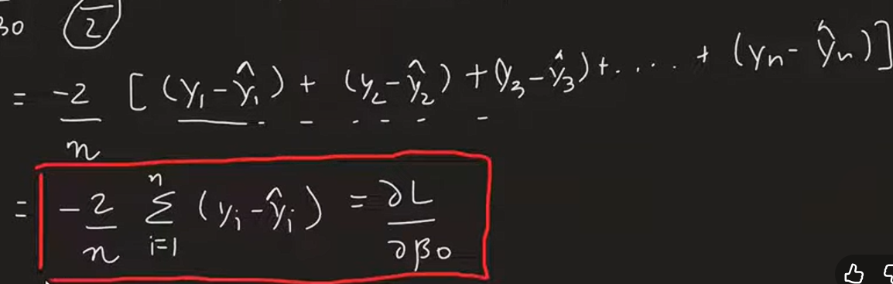

Partial derivative with respect to ${\beta_1}$

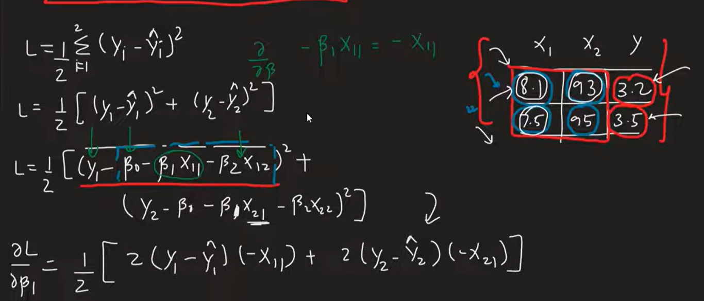

Now generalising the method for n dimension
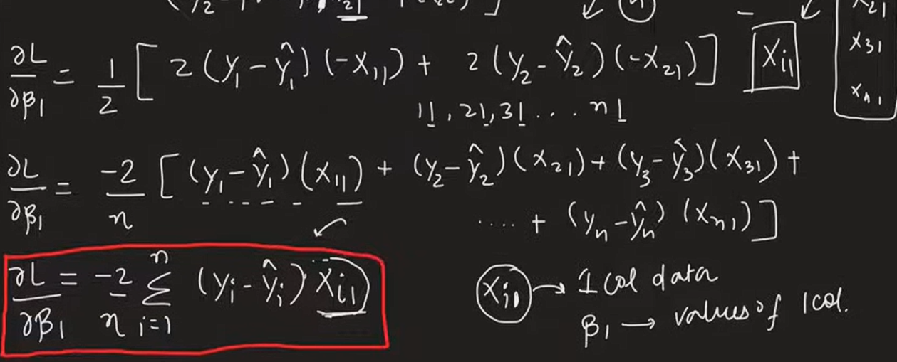
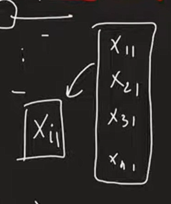

Partial derivative with respect to ${\beta_2}$

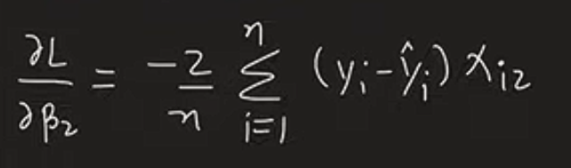

Generalised partial derivateve for ${\beta_1}$ ... ${\beta_n}$

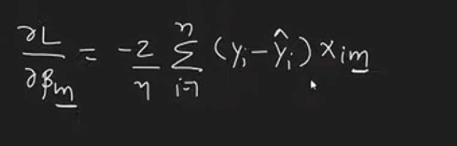

**New Topics :**

* Out of core learning : Out-of-core learning is a machine learning approach designed to handle datasets that are too large to fit into a computer’s main memory (RAM). Instead of loading the entire dataset at once, the algorithm processes the data in small chunks. E.g Mini batch processing, Stochastic gradient descent.
  
## There are mainly 2 types of ML Models

**Parametric Models :** In parametric models, the model structure is defined by a fixed number of parameters. Once these parameters are learned from the training data, the model can make predictions without needing to refer back to the entire dataset. Examples of parametric models include linear regression, logistic regression, and neural networks.

* Parametric models make strong assumptions about the data, such as assuming a specific functional form (e.g., linearity) or data distribution (e.g., Gaussian,linear). This can lead to underfitting if the assumptions do not hold true for the data.
* Fixed number of parameters regardless of the size of the training data. This can lead to faster training and prediction times, especially for large datasets.
  
**Non-Parametric Models :** Non-parametric models do not assume a fixed number of parameters. Instead, they can adapt their complexity based on the amount of training data available. These models often require storing the entire dataset or a significant portion of it to make predictions. Examples of non-parametric models include k-nearest neighbors (KNN), decision trees, and kernel density estimation.

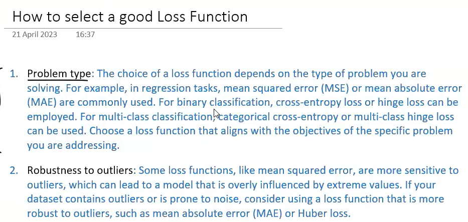
