Machine learning is a field of computer science that
uses statistical techniques to give computer systems
the ability to "learn" with data, without being
explicitly programmed.

## **Supervise Machine Learning**

* Types
  * **Regression :** It is used when the target/output column is numerical
  * **Classification :** It is used when the output column is categorical

## **Unsupervised Machine:**

* In Unsupervised ML you only have input
* Types :
  * **Clustering :** It detects that particulard data will fall in which group or category.

  * **Dimensionality Reduction :** When you are working with supervised ML you have too many input columns. it makes algo slow and it does not improve result because there are some columns that do not help in predicting. It is done using techniques like **PCA** .

        Also it is used in visualisation technique. Sometimes we cannot visualise a data because it is high dimensional data so we can plot it. so we use dimensionality redution to reduce dimension and then plot it E.g : MNIST Dataset

  * **Anomaly Detection :** It is used in detecting anomaly detection like detecting in manufacturing or credit card fraud detection so it basically detect outliers.

  * **Association rule learning :** Association Rule Learning is an unsupervised machine learning technique used to discover hidden relationships (patterns) between items in large datasets.For example it can be used in super market to find relationship between products and using that we can create combo offers.

## **Semi Supervised**

* It is partially unsupervised and partially supervised.It has small amount of labelled data and large amount of unlabeled data. Labelling data is expensive, slow and requires experts

## **Reinforcement Learning**

* Reinforcement Learning (RL) is a type of machine learning where an agent learns to make decisions by interacting with an environment to maximize cumulative rewards. The goal is to learn a policy that maximizes long-term reward.

## Extra Information

**Instance-based learning (memory-based / lazy learning) :** Learns by remembering instances. E.g. : K nearest neighbors

**Model-based learning (eager learning) :** The algorithm builds an explicit model that.

# **Simple Linear Regression**

Simple linear regression (SLR) is a fundamental supervised learning statistical method used to model the relationship between two variables: one independent variable and one dependent variable.

## Types

* Simple Linear Regression
* Multiple Linear Regression
* Polynomail Linear Regression : It is used when our data is not linear

### Simple Linear Regression

* What is best fit line : It is the line that minimizes errors across all data points according to chosen rules. That rule will be mean squared error.
* Intercept (β₀) : Expected value of y when X = 0
* β₁ : On average, how much does y change when X increases by 1 unit?”

The model never predicts ε.

* There are 2 ways to find the value of m and b.
  * **Closed form solution** :  (Direct mathematical formula using ordinary least square. Scikit learn is using this technique for linear regression algo).
  * Its only efficient for lower dimensional data. If a function is convex that means if the line between any two points on the function lies above the function having one one global minima or maxima then we can use closed form solution.

* **Non closed form solution** (Gradient Descent). Used for higher dimensional data. SGD Regressor in python uses this.
  
#### Regression evaluation metrics

* MAE (L1 Regression) : $\frac{1}{n}\sum_{i=1}^{n}\left|y_i-\hat{y}_i\right|$

  Advantages: Robuts to outliers.
  Disadvantages: It is not differentiable at 0.

* MSE : $\frac{1}{n}\sum_{i=1}^{n}\left(y_i-\hat{y}_i\right)^2$

  Advantages: It is differentiable
  Disadvantages: Not robust to outliers.

* RMSE : $\sqrt{\frac{1}{n}\sum_{i=1}^{n}\left(y_i-\hat{y}_i\right)^2}$

* R2 Score : $1-\frac{\sum_{i=1}^{n}\left(y_i-\hat{y}_i\right)^2}{\sum_{i=1}^{n}\left(y_i-\bar{y}\right)^2}$

  R² compares your model against a dumb model that always predicts mean(y).

 

 

Problem: R² never decreases when you add more features (predictors), even if those features are useless.

* Adjusted R2 score : It rewards you for adding useful features and punishes you for adding useless ones.
  

Shape of the cost function creates a bowl shaped curve having a single global minimum.

## Multi Linear Regression

* It is an extension of simple linear regression that uses multiple independent variables to predict the value of a dependent variable.
* The model is represented as: y = β₀ + β₁x₁ + β₂x₂ + ... + βₙxₙ
* In simple linear regression, we try to find the best-fit line because the relationship involves one independent variable and one dependent variable, which can be represented in a 2-dimensional plane. In multiple linear regression, we try to find the best-fit hyperplane because the relationship involves multiple independent variables, and the data exists in a higher-dimensional space (e.g., 3D or more).

* Formula for predicting value of y using matrix representation:

* This matrix can be decomposed to 2 matrices X and β where X is feature matrix and β is coefficient matrix. Dot product of these 2 matrices will give predicted value of y.

* The shape of X will be (m,n+1) where m is number of training examples and n is number of features. And shape of β will be (n+1,1) because we have n features and each feature will have one coefficient. So the shape of predicted y will be (m,1) because we have m training examples. its n+1 because of intercept term.
* cost function for multiple linear regression is as follows:

In Multiple Linear Regression (MLR), the key idea behind **Ordinary Least Squares (OLS)** is:

> Choose coefficients \(\beta\) such that the **Sum of Squared Errors (SSE)** is minimized.

---

## 1) Core objects in Multiple Linear Regression

The MLR model is:

$$
y = X\beta + \varepsilon
$$

Where:

### 1.1 Output vector \(y\) (n×1)

\(y\) contains all actual target values:

$$
y=
\begin{bmatrix}
y_1\\
y_2\\
\vdots\\
y_n
\end{bmatrix}
$$

* \(n\) = number of training examples

---

### 1.2 Feature matrix \(X\) (n×p)

\(X\) stores all feature values.

* \(n\) = number of samples (rows)
* \(p\) = number of parameters (columns)  
  (including intercept column of ones)

Example: intercept + two features \((x_1, x_2)\)

$$
X=
\begin{bmatrix}
1 & x_{11} & x_{12}\\
1 & x_{21} & x_{22}\\
\vdots & \vdots & \vdots\\
1 & x_{n1} & x_{n2}
\end{bmatrix}
$$

---

### 1.3 Coefficient vector \(\beta\) (p×1)

$$
\beta=
\begin{bmatrix}
\beta_0\\
\beta_1\\
\beta_2
\end{bmatrix}
$$

* $$\beta_0\ = intercept $$
* $$\beta_1,\beta_2,\dots\ = weights of features $$

---

### 1.4 Predicted values \(\hat{y}\) (n×1)

$$
\hat{y}=X\hat{\beta}
$$

Which means:

$$
\hat{y}=
\begin{bmatrix}
\hat{y}_1\\
\hat{y}_2\\
\vdots\\
\hat{y}_n
\end{bmatrix}
$$

---

### 1.5 Residual (error) vector \(e\) (n×1)

Residuals are the difference between actual and predicted values:

$$
e = y-\hat{y}
$$

So:

$$
e=
\begin{bmatrix}
y_1-\hat{y}_1\\
y_2-\hat{y}_2\\
\vdots\\
y_n-\hat{y}_n
\end{bmatrix}
$$

Each residual value:

$$
e_i=y_i-\hat{y}_i
$$

---

### Residual transpose vector \(e^T\) is (1×n)

$$
e^T=
\begin{bmatrix}
y_1-\hat{y}_1 & y_2-\hat{y}_2 & \cdots & y_n-\hat{y}_n
\end{bmatrix}
$$

### Residual vector \(e\) is (n×1)

$$
e=
\begin{bmatrix}
y_1-\hat{y}_1\\
y_2-\hat{y}_2\\
\vdots\\
y_n-\hat{y}_n
\end{bmatrix}
$$

Now multiply them:

$$
e^T e=
\begin{bmatrix}
y_1-\hat{y}_1 & y_2-\hat{y}_2 & \cdots & y_n-\hat{y}_n
\end{bmatrix}
\begin{bmatrix}
y_1-\hat{y}_1\\
y_2-\hat{y}_2\\
\vdots\\
y_n-\hat{y}_n
\end{bmatrix}
$$

Result is:

$$
e^Te=(y_1-\hat{y}_1)^2+(y_2-\hat{y}_2)^2+\cdots+(y_n-\hat{y}_n)^2
$$

✅ This is exactly the **Sum of Squared Errors (SSE)**.

---

## 3) Interpretation: What is SSE?

### ✅ SSE / RSS Meaning

\(e^T e\) is known as:

* SSE = Sum of Squared Errors
* RSS = Residual Sum of Squares
* Sum of Squared Residuals

It measures the **total squared prediction error** of the model on the dataset.

If SSE is small → predictions are close to actual values.  
If SSE is large → model predictions are far from actual values.

---

## 4) Why do we square the residuals?

For a sample:

$$
e_i = y_i - \hat{y}_i
$$

If we just summed residuals:

$$
\sum_{i=1}^{n} e_i
$$

Problems occur:

* positive and negative errors cancel out
* model may look “perfect” even when it isn’t

Example: errors \(+10\) and \(-10\)

$$
+10 + (-10) = 0
$$

So we square them:

$$
\sum_{i=1}^{n} e_i^2
$$

Benefits of squaring:

* makes all errors positive
* penalizes large errors heavily
* gives a smooth differentiable objective (easy optimization)

---

## 5) The OLS objective in matrix form

Since:

$$
e=y-X\beta
$$

_****------------------------------------****_

We will differentiate the equation shown in the image to find the best value of beta which minimizes the error. The equation after performing differentiation is shown below:

The shape of β will be (m+1,1) because we have m features and one intercept term.

$
e^Te = (y-X\beta)^T(y-X\beta)
$

---

## 6) Expanding the objective

Expanding:

$$
(y-X\beta)^T(y-X\beta)
$$

gives:

$$
(y-X\beta)^T(y-X\beta)
=
y^Ty - 2\beta^T X^T y + \beta^T X^T X \beta
$$

## 7) Minimization leads to Normal Equation

We minimize SSE by differentiating with respect to \(\beta\) and setting gradient to 0.

Result:

$$
X^T X \beta = X^T y
$$

This is the **Normal Equation**.

Solving for \(\beta\):

$$
\hat{\beta} = (X^T X)^{-1}X^T y
$$

This is the **closed-form OLS solution** (works if \(X^TX\) is invertible).

---

## 8) Geometric intuition (very important)

* \(y\) is a vector in \(n\)-dimensional space
* \(\hat{y}\) lies in the column space (span) of \(X\)

OLS chooses \(\hat{y}\) to be the **projection of \(y\)** onto the space spanned by columns of \(X\).

Residual:

$$
e = y - \hat{y}
$$

OLS ensures residual is perpendicular to the feature space:

$$
X^T e = 0
$$

Substitute \(e=y-X\beta\):

$$
X^T(y-X\beta)=0
$$

Which becomes:

$$
X^T X\beta = X^T y
$$

So the normal equation is actually a **perpendicularity condition**:
> error must be orthogonal to the space of predictors.

---

**Feature Scaling (Important for feature engineering):**

* Feature scaling are mainly of 2 types which are as folloews:
  * **Normalization**
    * Normalization is a data preprocessing technique that rescales numerical features to a common range, most commonly between 0 and 1, so that all features are on the same scale and differences in measurement units are eliminated.
    * It is not robuts to outliers because if there is an outlier then min and max value will be affected and all other values will be compressed in small range.
    * It is not necessary that the distribution shape will remain same after normalization.
    * Types of normalization :
      * **Min Max Scaling:** It scales the data to a fixed range, usually 0 to 1. It is mostly used in image processing where pixel values are between 0 to 255 because we know the maximum and minimum values and we want to scale it between 0 and 1.

      * As you can see that both these distribution first were not overlapping because of different scale but after min max scaling both are overlapping because both are in same scale now.

      * **Max Abs Scaling** : It scales the data by dividing each value by the maximum absolute value of that feature. The resulting values will be in the range [-1, 1]. It is mostly used when data is sparse where significant portion of the values are zero.

      * **Mean Normalization :** It is a technique used to scale features by subtracting the mean and dividing by the range (max - min) of the feature. This centers the data around zero and scales it to a range of -1 to 1.

      * Robust Scaling : It is used when data contains outliers. It uses median and interquartile range for scaling. It subtracts median from each value and then divides it by interquartile range.
  
  * **Standardization**
    * It is used when we know the distribution of data. It scales data such that mean becomes 0 and standard deviation becomes 1. It is based on z score and thats why it is also called z score normalization.
    * Z-score normalization (also called standardization) is the process of transforming every value in a feature into its z-score.
    * Shape of distribution does not change after standardization.
    * Standardization (z-score normalization) involves mean centering followed by scaling by the standard deviation. This transformation results in a feature with zero mean and unit variance, effectively rescaling the data without changing its distribution shape.
    * If we standardize the data then we can easily find outliers because outliers will have z score greater than 3 or less than -3.
    * Algorithms like decision tree, random forest do not require feature scaling because they are not based on distance.

* The main reason to do feature scaling is that some machine learning algorithms use distance between data points to make predictions. If one feature has a wide range of values, it can dominate the distance calculations and lead to biased results. By scaling features to a similar range, we ensure that all features contribute equally to the distance calculations.

**Feature Encoding (Important for feature engineering):**

## Loss Functions

## Gradient Descent

Problems faced in Gradient Descent:

Gradient descent baiscally helps us to find the minima of a function. It is an optimization algorithm used to minimize a function by iteratively moving towards the steepest descent, which is the direction of the negative gradient.

Step 1 : Initialize the parameters (weights) randomly or with some initial values.

Step 2 : Calculate the predicted output using current parameters.

Step 3 : Compute the loss (error) between predicted output and actual output using a loss function.

Step 4: Calculate the gradient of the loss function with respect to each parameter. The gradient represents the direction and rate of change of the loss function. It is computed using derivatives. If the gradient of a parameter is positive, increasing that parameter increases the loss, so the parameter value is decreased. If the gradient is negative, increasing the parameter decreases the loss, so the parameter value is increased. In this way, the parameters are adjusted in the direction opposite to the gradient to move toward the minimum of the loss function.

Step 5: Update the parameters using the calculated gradients and a learning rate, which determines the step size for each update. The learning rate is a hyperparameter that needs to be chosen carefully; too large a learning rate can cause overshooting of the minimum, while too small a learning rate can lead to slow convergence. So updated parameter = current parameter - learning rate * gradient(slope).

Step 6: Repeat steps 2 to 5 until convergence, which occurs when the change in loss is below a certain threshold or after a fixed number of iterations.

--------------------------------------------------------

For L(m,b) first we will calculate partial derivative with respect to m and b.

Types of Gradient Descent:

* **Batch Gradient Descent** : It uses the entire dataset to compute the gradient of the loss function for each iteration. It provides a stable and accurate estimate of the gradient but can be computationally expensive for large datasets. It is mainly used when the dataset is small enough to fit into memory and also converges smoothly towards the minimum of the loss function. Convex functions are best suited for batch gradient descent because BGD can get stuck in local minima or saddle points in non convex function.
* **Stochastic Gradient Descent :** It updates the parameters using the gradient computed from a single randomly selected data point. This makes it much faster and allows it to start improving the model right away. However, the updates can be noisy and may lead to a less stable convergence. Its name is stochastic because of the randomness involved in selecting data points for each update.
* The final solution may oscillate around the minimum rather than converging smoothly because of randomness in selecting data points for each update.
* In stochastic it is possible that **step n+1 is worse than step n because of randomness.** while in batch it is not possible because it uses entire data.
* In SGD we can face a problem wherein even near the solution the updates can be large and erratic because of high variance in gradient estimates from single data points. To mitigate this, techniques like learning rate scheduling (gradually decreasing the learning rate over time) and data shuffling (randomizing the order of data points before each epoch) are commonly used.

* Advantages of stochastic gradient descent include faster convergence, ability to escape local minima, and suitability for large datasets. It is mainly used when the dataset is too large to fit into memory or when we want to quickly iterate over the data. Non-convex functions are best suited for stochastic gradient descent.
* Gradient estimates in stochastic gradient descent are noisy, leading to oscillations around the minimum; requires careful learning rate scheduling and data shuffling.
* SGD’s noise can actually help escape saddle points and poor local minima. Deep learning is non-convex + large-scale and that's why SGD practical and effectively always used to train deep learning models.

* **Why SGD uses random rows (not sequential)**

* SGD updates model parameters using one random data row (or sequential rows after shuffling) because:

* Prevents ordering bias: real datasets are often sorted/grouped (by class, time, category). Sequential updates can make SGD learn in a biased direction.

* Reduces correlated gradients: consecutive rows are similar → gradients become similar → slow/unstable learning. Randomization breaks this correlation.

* Unbiased gradient estimate: random sampling ensures the expected SGD gradient points toward the true/full gradient direction.

* **Mini-Batch Gradient Descent :** It is a compromise between batch and stochastic gradient descent. It divides the dataset into small batches and computes the gradient for each batch. This approach balances the computational efficiency of stochastic gradient descent with the stability of batch gradient descent.

## Gradient Descent for n dimensional data

Partial derivative with respect to ${\beta_0}$

Now generalising the method for n dimension

Partial derivative with respect to ${\beta_1}$

Now generalising the method for n dimension

Partial derivative with respect to ${\beta_2}$

Generalised partial derivateve for ${\beta_1}$ ... ${\beta_n}$

What is statistical inference problems?
Statistical inference is the process of drawing conclusions about a population based on a sample of data taken from that population. It involves using statistical methods to analyze the sample data and make inferences about the characteristics, relationships, or patterns that exist in the larger population.

Reducible error vs Irreducible error:

* Reducible Error: This is the portion of the error that can be reduced or minimized by improving the model. It includes errors due to bias (systematic errors from incorrect assumptions in the model) and variance (errors due to sensitivity to fluctuations in the training data). By selecting a better model, tuning hyperparameters, or using more data, we can reduce this type of error.
* Irreducible Error: This is the portion of the error that cannot be reduced, regardless of the model used. It is inherent in the data due to noise, measurement errors, or other random factors that affect the outcome. No matter how well we optimize our model, this error will always be present.

For example, in a house price prediction model, reducible error could come from using a linear model when the relationship is non-linear (bias) or from overfitting to a small training set (variance). Irreducible error could come from unpredictable factors like sudden market changes or unique features of individual houses that are not captured in the data.

Difference between statistical learning and machine learning:

Statistical Learning:

* Focuses on understanding the underlying relationships between variables and making inferences about the population.
* Often uses traditional statistical methods like linear regression, logistic regression, and hypothesis testing.
* Typically deals with smaller datasets and focuses on parameter estimation.
  
Machine Learning:

* Focuses on making accurate predictions and improving performance on specific tasks.
* Utilizes a wide range of algorithms, including decision trees, neural networks, and ensemble methods
* Typically deals with large datasets and focuses on pattern recognition.

**Difference between inference and prediction:**

Inference:**

* Inference is the process of drawing conclusions about a population based on a sample of data.
* It focuses on understanding the relationships between variables and identifying significant factors that influence the outcome.
* It often involves hypothesis testing and estimating parameters of a statistical model.

**Prediction:**

* Prediction is the process of using a model to forecast or estimate the value of an outcome variable based on input features.
* The goal of prediction is to achieve high accuracy in estimating future outcomes.

Regression Analysis:
Regression analysis is a statistical method used to examine the relationship between a dependent variable (also known as the outcome or response variable) and one or more independent variables (also known as predictors or explanatory variables). The primary goal of regression analysis is to model the relationship between these variables in order to make predictions, understand the strength and nature of the relationships, and identify significant factors that influence the dependent variable.

Using libraries like statsmodels in Python, we can perform regression analysis and obtain detailed statistical summaries of the results, including coefficients, p-values, R-squared values, and more.

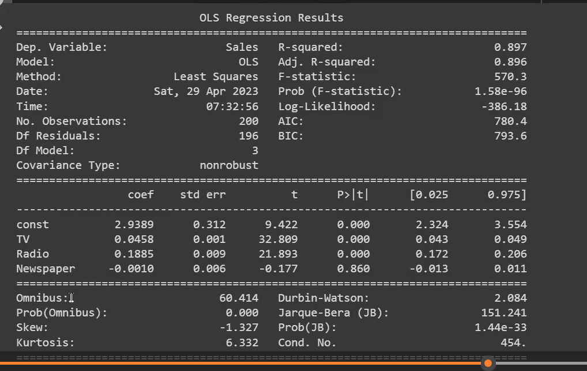

TSS (Total Sum of Squares) : It measures the total variability in the dependent variable. It quantifies how much the observed values of the dependent variable deviate from their mean.

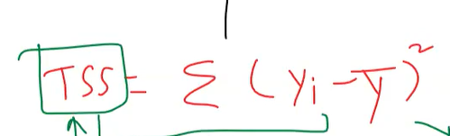

Definition of RSS
The Residual Sum of Squares (RSS) is a key concept in regression analysis that measures the total deviation of the predicted values from the actual values. It is calculated as the sum of the squares of the residuals, which are the differences between the observed values and the predicted values from the model.

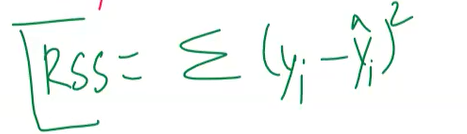

ESS (Explained Sum of Squares) : It quantifies how much the predicted values generated by the regression model deviate from the mean of the dependent variable.

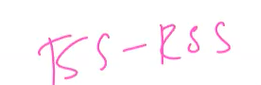

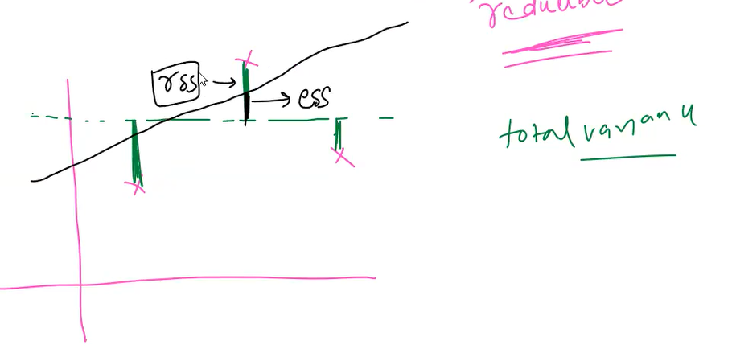

Degree of Freedom (DF) : It refers to the number of independent pieces of information that are available to estimate a parameter or calculate a statistic. In regression analysis, degrees of freedom are used to determine the number of independent observations that contribute to the estimation of the regression coefficients.
Formula for calculating degrees of freedom in regression analysis:

* For the regression model: DF = k (where k is the number of independent variables)
* For the residuals (error term): DF = n - k - 1 (where n is the total number of observations and k is the number of independent variables)

Df Total : It represents the total number of observations minus one (n - k - 1 + k = n - 1), where n is the total number of observations in the dataset.

R-squared (R²) : It is a statistical measure that represents the proportion of the variance in the dependent variable that is explained by the independent variables in the regression model. It ranges from 0 to 1, where a value of 1 indicates that the model perfectly explains the variability in the dependent variable, while a value of 0 indicates that the model does not explain any of the variability.

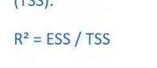

Adjusted R-squared : It is a modified version of R-squared that takes into account the

f-statistic : It is used to determine whether there is a significant relationship between the dependent variable and the independent variables in the regression model. It tests the null hypothesis that all regression coefficients are equal to zero (i.e., no relationship) against the alternative hypothesis that at least one coefficient is not equal to zero.

Regression analysis can be used for various purposes, including:

1. Prediction: Estimating the value of the dependent variable based on the values of the independent variables.
2. Inference: Understanding the relationships between variables and determining which independent variables have a significant impact on the dependent variable.
3. Modeling: Creating mathematical models that describe the relationships between variables.
4. Hypothesis Testing: Testing hypotheses about the relationships between variables.

Regression analysis assumptions:

1. Linearity: The relationship between the independent and dependent variables is linear.
2. Independence: The observations are independent of each other.
3. Homoscedasticity: The variance of the residuals (errors) is constant across all levels of the independent variables.
4. Normality: The residuals are normally distributed.
5. No Multicollinearity: The independent variables are not highly correlated with each other.
6. No Autocorrelation: The residuals are not correlated with each other, especially in time series data.
7. Exogeneity: The independent variables are not correlated with the error term.
8. Measurement Level: The dependent variable is continuous, and the independent variables can be continuous or categorical.
9. No Outliers: There are no extreme values that can unduly influence the results of the regression analysis.
10. Correct Model Specification: The model includes all relevant variables and is correctly specified.
11. Stationarity (for time series data): The statistical properties of the time series data do not change over time.
12. No Perfect Multicollinearity: There should be no perfect linear relationship among the independent variables.
13. No Measurement Error: The independent variables are measured without error.
14. Additivity: The effects of the independent variables on the dependent variable are additive.
15. No Omitted Variable Bias: All relevant variables that influence the dependent variable are included in the model.
16. Sufficient Sample Size: The sample size should be large enough to provide reliable estimates of the regression coefficients.
17. Model Stability: The relationships modeled should be stable over time and across different samples.
18. Linearity in Parameters: The model should be linear in terms of the parameters (coefficients), even if the relationship between variables is non-linear.
19. No Influential Points: There should be no individual data points that have a disproportionate impact on the regression results.
20. Correct Functional Form: The chosen functional form of the regression model should accurately represent the underlying relationship between the variables.
21. No Endogeneity: The independent variables should not be correlated with the error term, which can lead to biased estimates.
22. No Heteroscedasticity: The variance of the residuals should be constant across all levels of the independent variables.

if all these assumptions are met, the results of the regression analysis can be considered valid and reliable. Violations of these assumptions can lead to biased estimates, incorrect inferences, and unreliable predictions.

# TREE BASED MODELS

Tree based models are a type of supervised machine learning algorithms that use decision trees to make predictions. Decision trees are hierarchical structures that recursively split the data into subsets based on the values of input features. Each internal node represents a feature, each branch represents a decision rule, and each leaf node represents a predicted outcome.

Tree based models can be used for both classification and regression tasks.

Types of Tree based models:

## Decision Tree

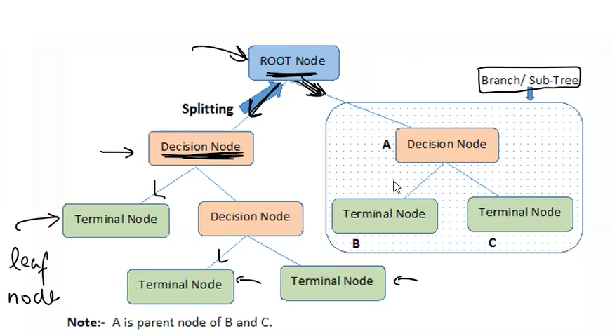

It is a simple tree based model that splits the data into subsets based on the values of input features. It can be used for both classification and regression tasks.

It is white box model because we can easily interpret the model by visualizing the decision tree. We can see how the model is making decisions and which features are important for making predictions.

It is non parametric model because it does not make any assumptions about the underlying data distribution. It can handle both numerical and categorical data.

It is mother of all tree based models because other tree based models like random forest, gradient boosting etc are based on decision tree.

Different algorithms to build decision tree:

* **ID3 (Iterative Dichotomiser 3) :** It uses information gain as the splitting criterion. It selects the feature that maximizes the information gain at each node. It can only handle categorical features.
* **C4.5 :** It is an extension of ID3 that uses gain ratio as the splitting criterion. It selects the feature that maximizes the gain ratio at each node. It can handle both continuous and categorical features.
* **CART (Classification and Regression Trees) :** It uses Gini impurity as the splitting criterion for classification tasks and mean squared error for regression tasks. It selects the feature that minimizes the Gini impurity or mean squared error at each node. It creates binary trees, where each node has at most two children. It can handle both continuous and categorical features. sklearn's DecisionTreeClassifier and DecisionTreeRegressor are based on CART algorithm.

Impurity : Impurity is a measure of how mixed the classes are in a dataset. It quantifies the degree of uncertainty or disorder in the data. The goal of a decision tree is to create splits that result in subsets with low impurity, meaning that the instances within each subset belong to the same class as much as possible.

Impurity functions are used to measure the quality of a split in decision trees. They quantify how well a feature separates the classes in the dataset. The goal is to find the feature that results in the most homogeneous subsets after the split. It is the deciding factor for selecting the best feature to split the data at each node of the decision tree.

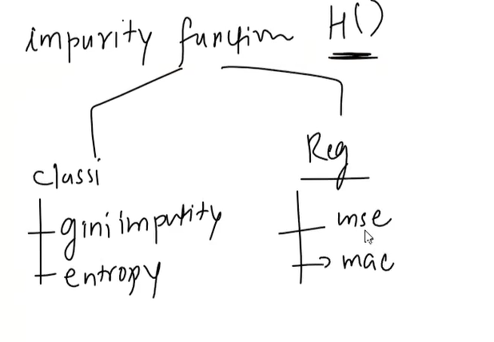

Calculate h() left and h() right for each split and then calculate the weighted impurity of the split called overall impurity and is represented using (G).

so calculate G for each column and select the column which gives minimum G value because minimum G value means maximum reduction in impurity.

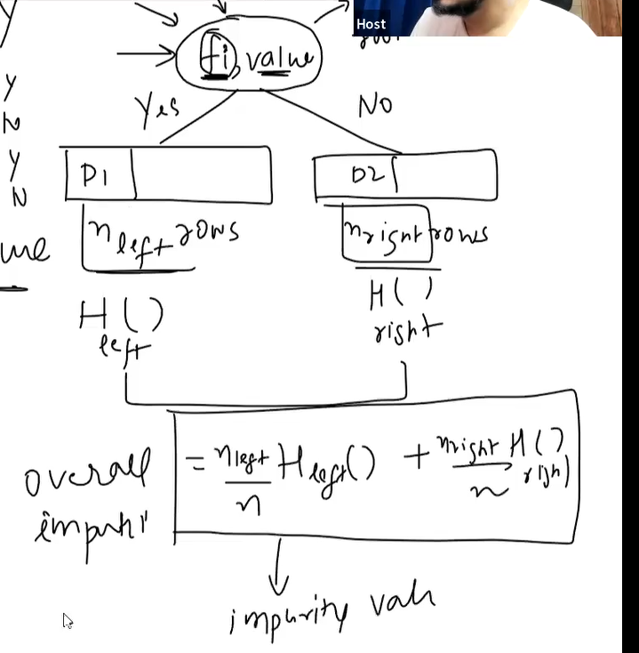

Impurity Measures:

* **Gini Impurity :** It measures the probability of misclassifying a randomly chosen element from the dataset. It is calculated as: Gini = 1 - ∑(p_i)^2 where p_i is the proportion of instances belonging to class i. It ranges from 1 < gin <= 0.It is computationally efficient and works well in practice. It is used in CART algorithm. It is less sensitive to class imbalance compared to entropy. It is faster to compute than entropy because it does not involve logarithmic calculations. It tends to create balanced trees, which can lead to better generalization. It is less affected by outliers compared to entropy.

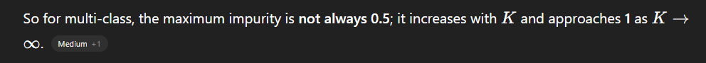

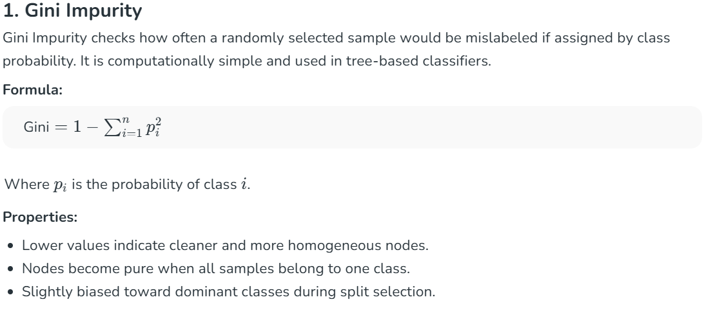

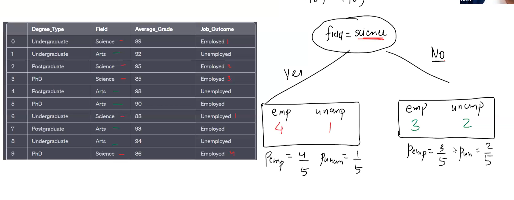

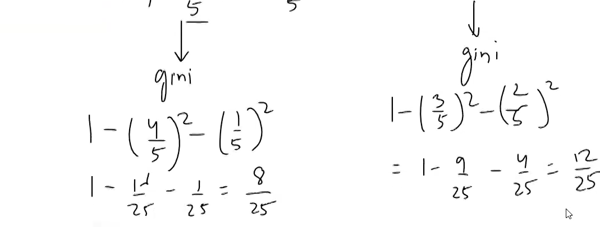

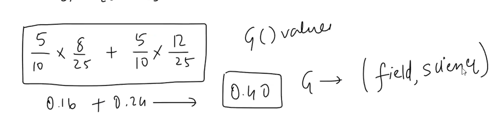

For numerical features, we need to find the best threshold to split the data. We can do this by sorting the unique values of the feature and then calculating the impurity for each possible split point (midpoint between two consecutive unique values). The split point that results in the lowest impurity is selected as the best threshold.

Feature importance using ginni:

steps:
1. Calculate the Gini impurity of the parent node (before the split).
2. For each feature, iterate through all possible split points:
   a. Split the data into left and right subsets based on the split point.
   b. Calculate the Gini impurity for the left and right subsets.
   c. Calculate the weighted Gini impurity of the split using the formula: Weighted Gini = (n_left / n_total) * Gini_left + (n_right / n_total) * Gini_right where n_left and n_right are the number of instances in the left and right subsets, respectively, and n_total is the total number of instances.
   d. Calculate the Gini gain for the split using the formula: Gini Gain = Gini_parent - Weighted Gini
3. Select the split point that results in the highest Gini gain as the best threshold for that feature.
4. Repeat steps 2-3 for all features and select the feature with the highest Gini gain as the best feature to split the data at the current node.
5. The Gini gain for the selected feature can be used as a measure of feature importance. Features with higher Gini gain are considered more important for making predictions.
6. Repeat the process recursively for each child node until a stopping criterion is met (e.g., maximum depth, minimum samples per leaf, or pure leaf nodes).
7. The final decision tree can be used for making predictions on new data by traversing the tree based on the feature values of the input instance.
8. The feature importance can be calculated by summing the Gini gains for each feature across all nodes in the tree where that feature is used for splitting. The importance scores can then be normalized to obtain relative importance values.
9. The resulting feature importance scores can be used to identify the most relevant features for the prediction task and can also be used for feature selection or dimensionality reduction.

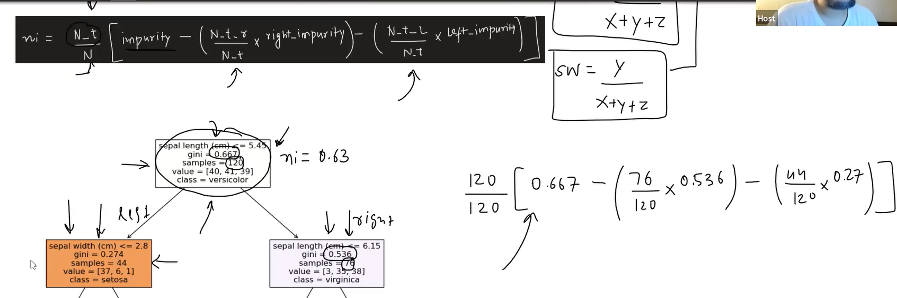
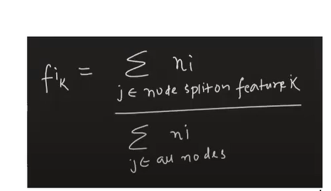

**CART FOR REGRESSION:**
In regression tasks, CART uses mean squared error (MSE) as the splitting criterion. The goal is to minimize the MSE in the resulting subsets after the split. The MSE is calculated as the average of the squared differences between the actual values and the predicted values (mean of the subset).

Instead of fitting one global equation like Linear Regression, CART does this: “Let me ask a sequence of simple questions that split houses into groups where prices are similar.”

While in case of classification majority is considered as the predicted value for a leaf node, in regression mean of all the datapoints in region is considered as the predicted value for a leaf node.

Steps to calculate MSE for regression:

1. For each possible split point in the feature, divide the data into two subsets: left and right.
2. Calculate the mean of the target variable for each subset.
3. Calculate the MSE for each subset using the formula: MSE = (1/n) * ∑(y_i - mean)^2 where n is the number of instances in the subset, y_i is the actual value, and mean is the mean of the target variable for that subset.
4. Calculate the weighted MSE for the split using the formula: Weighted MSE = (n_left / n_total) *MSE_left + (n_right / n_total)* MSE_right where n_left and n_right are the number of instances in the left and right subsets, respectively, and n_total is the total number of instances.
5. Select the split point that results in the lowest weighted MSE as the best threshold.

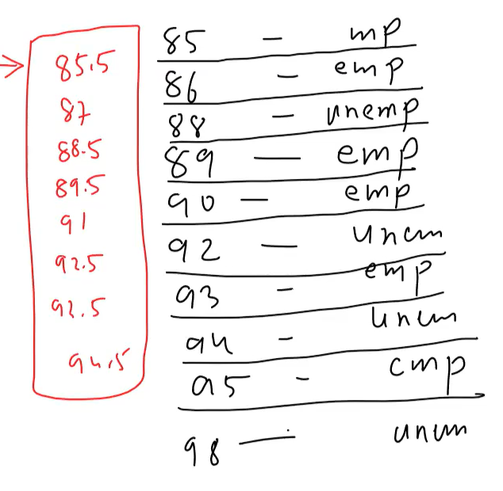

* **Entropy :** It measures the amount of uncertainty or disorder in the dataset. It is calculated as: Entropy = - ∑(p_i * log2(p_i)) where p_i is the proportion of instances belonging to class i.

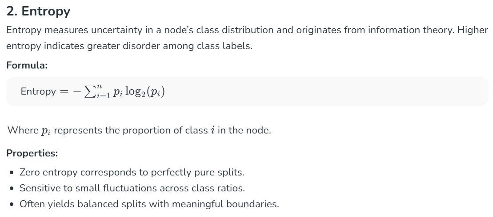

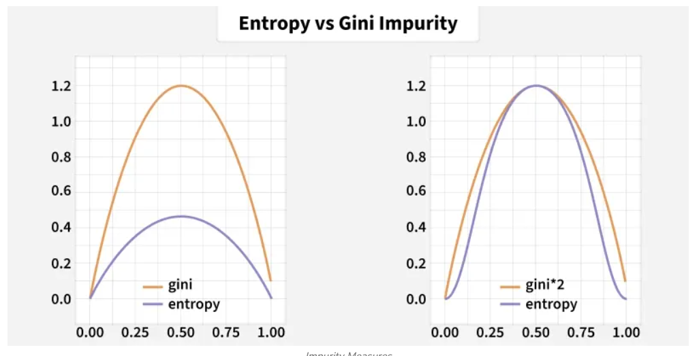

Splitting Criteria:

* **Information Gain :** It measures the reduction in entropy or impurity after splitting the dataset based on a feature. It is calculated as: Information Gain = Entropy(parent) - ∑( (|child| / |parent|) * Entropy(child) ) where |child| is the number of instances in the child node and |parent| is the number of instances in the parent node.
* **Gini Gain :** It measures the reduction in Gini impurity after splitting the dataset based on a feature. It is calculated as: Gini Gain = Gini(parent) - ∑( (|child| / |parent|) * Gini(child) ) where |child| is the number of instances in the child node and |parent| is the number of instances in the parent node.
* **Gain Ratio :** It is a modified version of information gain that takes into account the intrinsic information of a feature. It is calculated as: Gain Ratio = Information Gain / Split Information where Split Information = - ∑( (|child| / |parent|) * log2(|child| / |parent|) )

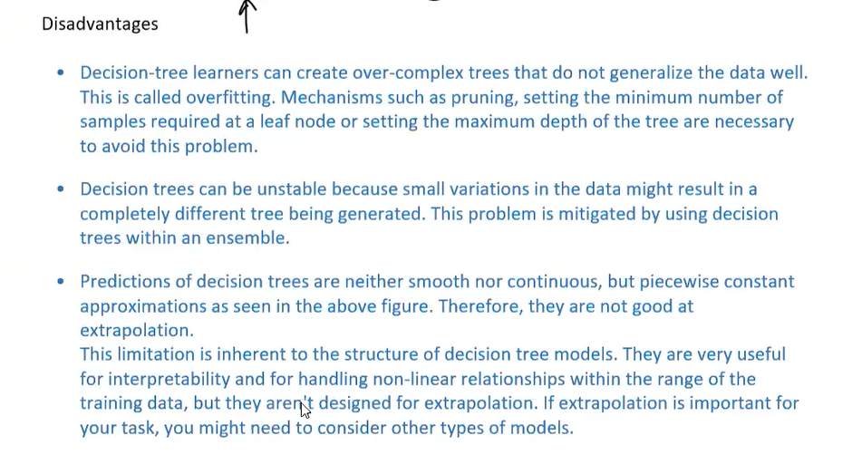

One of the major problems with decision trees is overfitting. Overfitting occurs when the model learns the training data too well, including noise and outliers, resulting in poor generalization to new data. To prevent overfitting, we can use techniques such as:

* Pruning : It involves removing branches from the decision tree that do not provide significant predictive power. This can be done by setting a maximum depth for the tree, minimum samples required to split a node, or minimum samples required at a leaf node.
  * There are two types of pruning:
    * Pre-pruning : It involves stopping the growth of the tree before it reaches its maximum depth. This can be done by setting a maximum depth for the tree, minimum samples required to split a node, or minimum samples required at a leaf node.
    * Post-pruning : It involves growing the full tree and then removing branches that do not provide significant predictive power. This can be done by evaluating the performance of the tree on a validation set and removing branches that do not improve the performance.

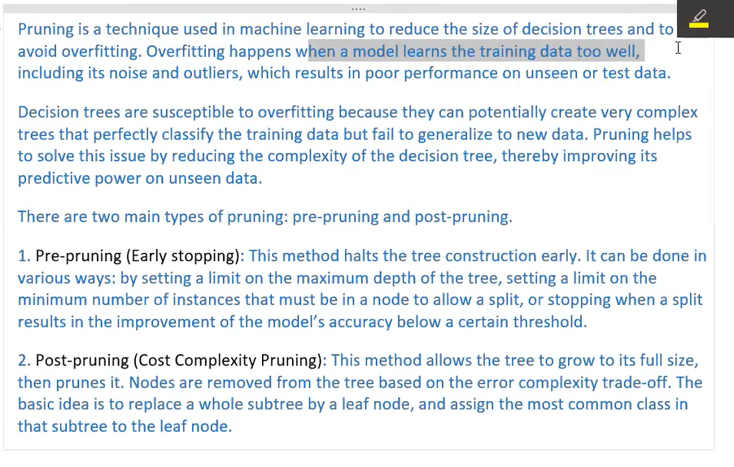
  
* Setting minimum samples per leaf : It ensures that each leaf node has a minimum number of samples, preventing the tree from creating overly specific rules that may not generalize well.
* Setting maximum depth : It limits the depth of the tree, preventing it from growing too deep and capturing noise in the data.
* Setting minimum samples per split : It ensures that a node must have a minimum number of samples before it can be split, preventing the tree from creating splits based on very few samples.
  
**And also other biggest disadvantage of decision tree is extrapolation. Decision trees cannot extrapolate beyond the range of the training data. For example, if a decision tree is trained on house prices ranging from $100,000 to $500,000, it cannot accurately predict the price of a house worth $600,000. This is because decision trees make predictions based on the splits created during training, and they do not have a mechanism or equation like linear regression to infer values outside the observed range. So when the input range is restricted then only we can go with decision tree**

## Ensemble Methods

Ensemble methods combine multiple decision trees to improve the accuracy and robustness of predictions. Some popular ensemble methods include:

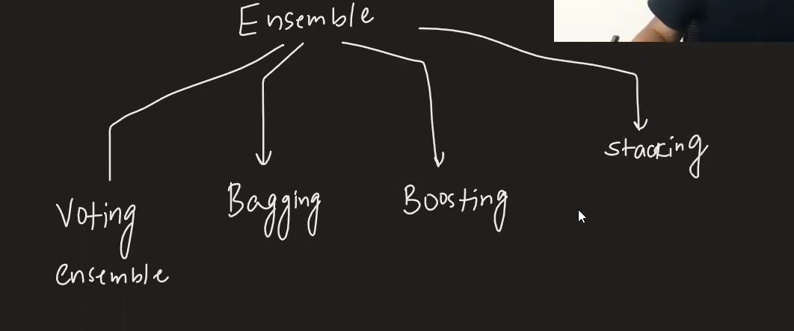
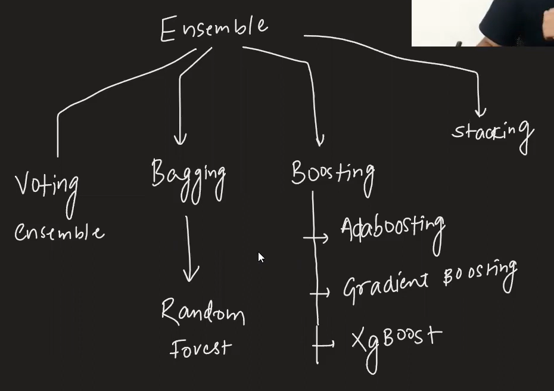

* Random Forest : It is an ensemble learning method that combines multiple decision trees to improve the accuracy and robustness of predictions. Each tree is trained on a random subset of the data and a random subset of features. The final prediction is made by aggregating the predictions of all the trees (majority voting for classification and averaging for regression).

* Gradient Boosting Machines (GBM) : It is another ensemble learning method that builds decision trees sequentially, where each tree tries to correct the errors of the previous tree. The final prediction is made by combining the predictions of all the trees, weighted by their performance.

* Extreme Gradient Boosting (XGBoost) : It is an optimized implementation of gradient boosting that is designed to be highly efficient and scalable. It includes several advanced features, such as regularization, parallel processing, and handling missing values, which make it a popular choice for machine learning competitions and real-world applications.

* LightGBM : It is a gradient boosting framework that uses tree-based learning algorithms. It is designed to be efficient and scalable, with a focus on speed and memory usage. LightGBM uses a histogram-based approach to split the data, which allows it to handle large datasets with high dimensionality.

* CatBoost : It is a gradient boosting library that is designed to handle categorical features automatically. It uses a combination of decision trees and gradient boosting to make predictions, and includes several advanced features, such as handling missing values and reducing overfitting.

* AdaBoost : It is an ensemble learning method that combines multiple weak classifiers to create a strong classifier. It works by iteratively training weak classifiers on the data, where each classifier focuses on the misclassified instances from the previous classifier. The final prediction is made by combining the predictions of all the classifiers, weighted by their performance.

* Stacking : It is an ensemble learning method that combines multiple base models to create a meta-model. The base models are trained on the data, and their predictions are used as input features for the meta-model. The meta-model is then trained to make the final prediction based on the predictions of the base models.

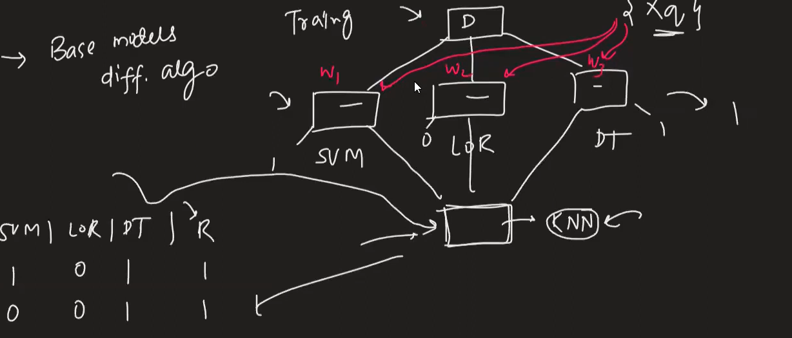

* Voting Classifier : It is an ensemble learning method that combines multiple classifiers to make a final prediction. Each classifier makes a prediction, and the final prediction is made by majority voting (for classification) or averaging (for regression).

* Bagging (Bootstrap Aggregating) : It is an ensemble learning method that combines multiple models using same algorithm but it is trained on different subsets of the data. Each model is trained on a random subset of the data (with replacement), and the final prediction is made by aggregating the predictions of all the models (majority voting for classification and averaging for regression).

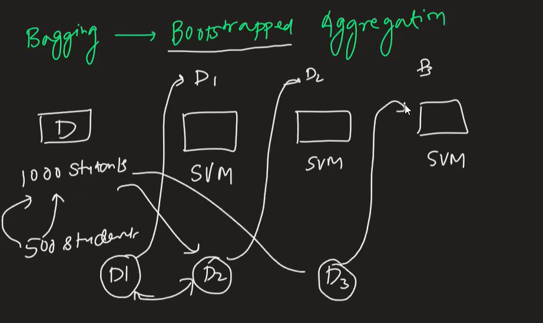

* Boosting : It is an ensemble learning method that combines multiple weak models to create a strong model. Each model is trained sequentially, where each model tries to correct the errors of the previous model. The final prediction is made by combining the predictions of all the models, weighted by their performance.

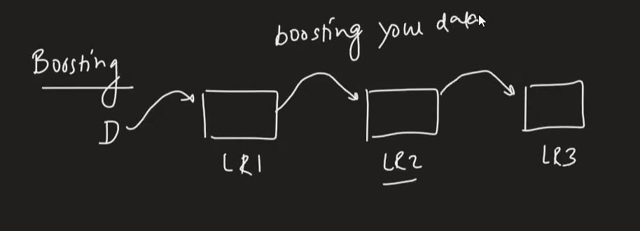

Why ensemble methods work?
Ensemble methods work because they combine the strengths of multiple models to create a more robust and accurate prediction. By aggregating the predictions of multiple models, ensemble methods can reduce the impact of individual model errors and improve overall performance. This is particularly effective when the individual models are diverse and make different types of errors.

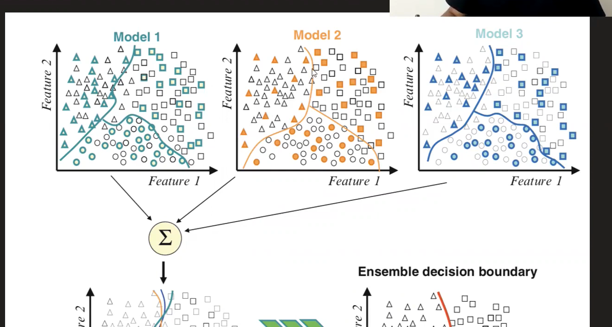
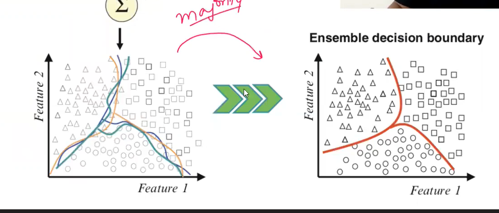
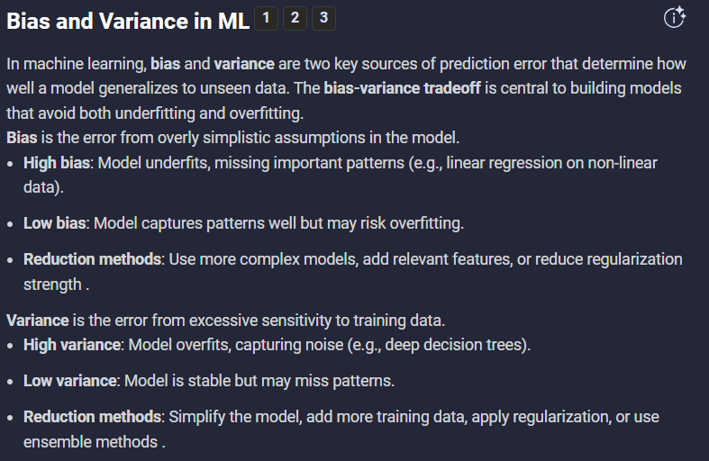

For e.g in decision tree we mostly face the problem of low bias and high variance. By using ensemble methods like random forest and boosting we can reduce the variance and improve the accuracy of the model.

Similarly in case of linear regression we mostly face the problem of high bias and low variance. By using ensemble methods like bagging we can reduce the bias and improve the accuracy of the model.
**New Topics :**

* Out of core learning : Out-of-core learning is a machine learning approach designed to handle datasets that are too large to fit into a computer’s main memory (RAM). Instead of loading the entire dataset at once, the algorithm processes the data in small chunks. E.g Mini batch processing, Stochastic gradient descent.

# Support vector machines (SVM)
Support Vector Machines (SVM) is a supervised machine learning algorithm used for classification and regression tasks. Their primary goal is to find the optimal boundary, called a hyperplane, that separates data points into distinct classes. This hyperplane ensures the widest possible margin between the closest data points of each class, which are known as support vectors.

SVM works by maximizing the margin between classes, which improves the model's ability to generalize to unseen data. For linearly separable data, SVM identifies a straight-line hyperplane. For non-linear data, it uses a kernel trick to map the data into a higher-dimensional space where it becomes linearly separable.

Imagine you have two groups of points (e.g., red and blue) on a graph. SVM finds the line (or hyperplane) that best separates these groups while maximizing the distance (margin) from the nearest points of each group. If the data cannot be separated by a straight line, SVM applies a kernel function to transform the data into a higher-dimensional space where separation is possible.

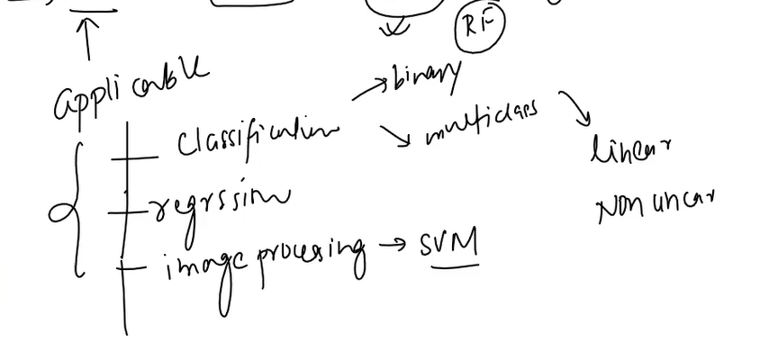

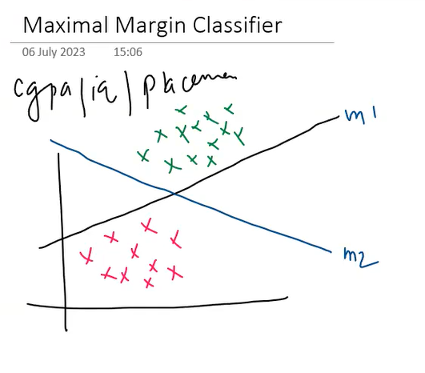

Which is better m1 or m2 ?

M2 is better because it has a larger margin between the classes compared to M1. A larger margin indicates that the model is more robust and less likely to misclassify new data points.

It is the best out of the box classifier because it works well on both linear and non-linear data. It is also effective in high-dimensional spaces and can handle large datasets.

Maximial margin classifier : The optimal hyperplane is the one that maximizes the margin between the two classes. The margin is defined as the distance between the hyperplane and the nearest data points from each class, known as support vectors. By maximizing the margin, SVM aims to create a decision boundary that is robust and generalizes well to unseen data. It can only be applied to linearly separable data. It is also known as hard margin classifier.

Know lets discuss about the mathematical formulation of SVM in detail and in depth in simple and intutive way.

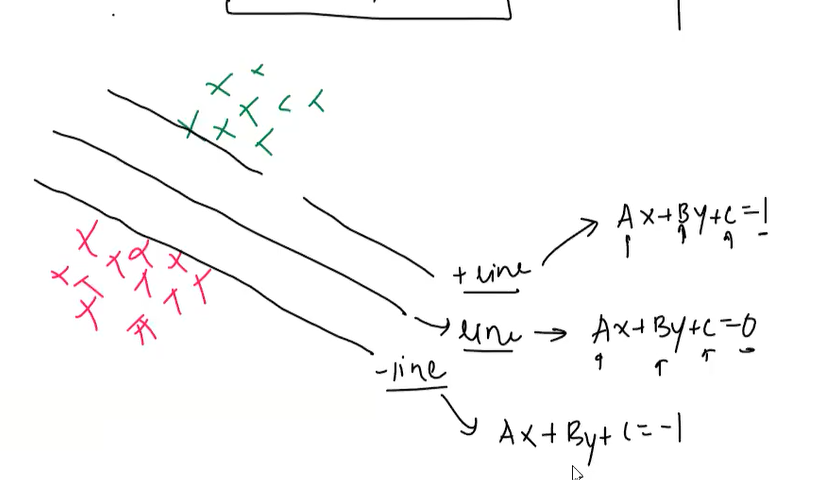

Reason ?

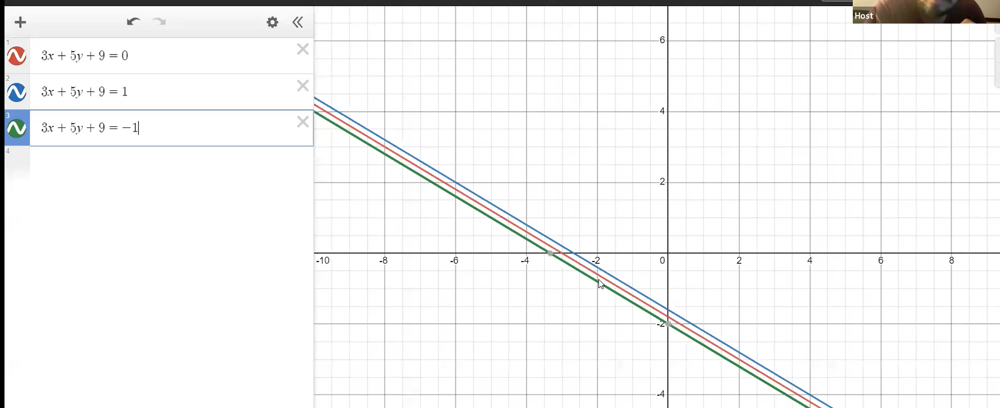

The constriant is that the green data points should be on one side of the hyperplane and they should not cross ax+by+c = 1 line and the red data points should be on the other side of the hyperplane and they should not cross ax+by+c = -1 line.

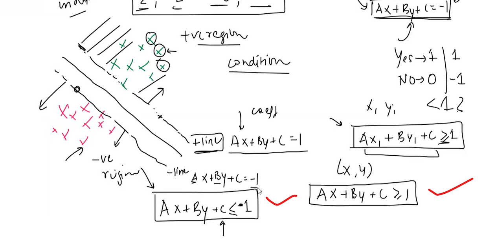

As you can see the formula but we are having 2 formula instead we can combine both the formula into one by multiplying yi to both the formula.

Updated Formula is :
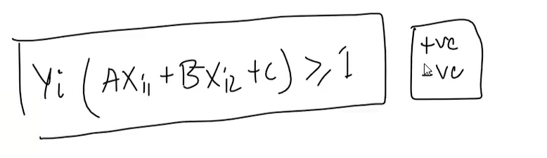

This updated formula is applicable for both the classes. the mathematical intuition behind this formula is that for positive class points (yi = +1), the distance from the hyperplane should be at least 1, and for negative class points (yi = -1), the distance should be at most -1. By multiplying yi to both sides of the inequality, we can combine the two conditions into a single constraint that applies to all data points. Because the inequality sign flips when we multiply by a negative number.

How to find the distance between two lines ?
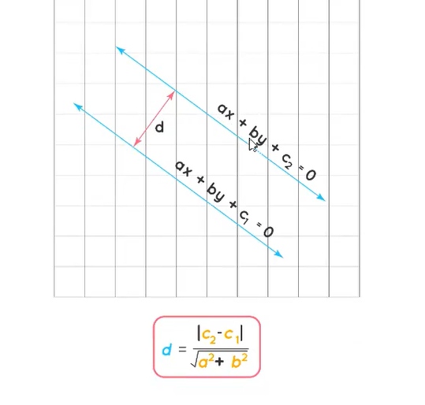

But this same formula will not work for SVM because of differet equation of lines in SVM.
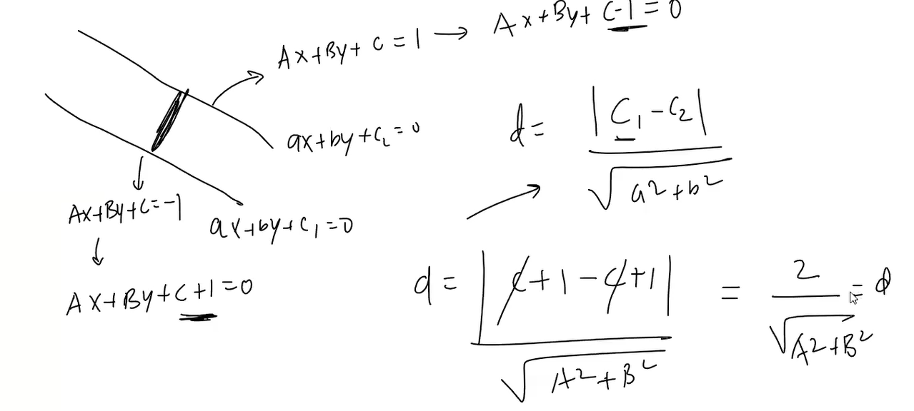

**Final**

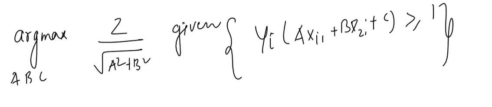

1. Objective Function : The objective of SVM is to find the hyperplane that maximizes the margin between the two classes. This can be formulated as an constraint optimization problem where we want to minimize the norm of the weight vector (||w||) subject to the constraint that all data points are correctly classified.
2. Constraints : The constraints ensure that all data points are correctly classified. For a data point (x_i, y_i), where x_i is the feature vector and y_i is the class label (+1 or -1), the constraint can be expressed as: y_i * (w · x_i + b) >= 1. This means that for positive class points (y_i = +1), the distance from the hyperplane should be at least 1, and for negative class points (y_i = -1), the distance should be at most -1.
3. Lagrange Multipliers : To solve the optimization problem with constraints, we can use Lagrange multipliers. We introduce a Lagrange multiplier (α_i) for each constraint and formulate the Lagrangian function as: L(w, b, α) = 1/2 ||w||^2 - ∑(α_i * [y_i * (w · x_i + b) - 1]). The goal is to maximize the Lagrangian with respect to α and minimize it with respect to w and b.

## Prediction using SVM:
Once the optimal hyperplane is found, we can use it to make predictions on new data points.

## Soft Margin SVM:
In real-world scenarios, data is often not perfectly separable. To handle such cases, SVM introduces the concept of soft margin, which allows some misclassifications in the training data. This is achieved by introducing slack variables (ξ_i) that measure the degree of misclassification for each data point. The objective function is modified to include a penalty term for misclassifications, controlled by a regularization parameter (C). The updated objective function becomes: Minimize (1/2 ||w||^2 + C ∑(ξ_i)) subject to the constraints: y_i * (w · x_i + b) >= 1 - ξ_i and ξ_i >= 0 for all i. if 

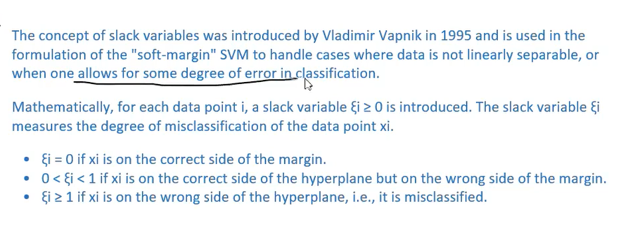
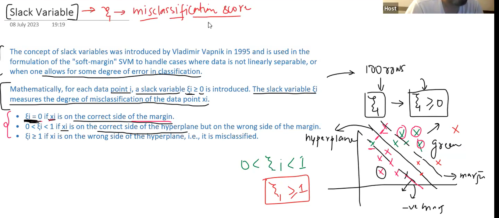
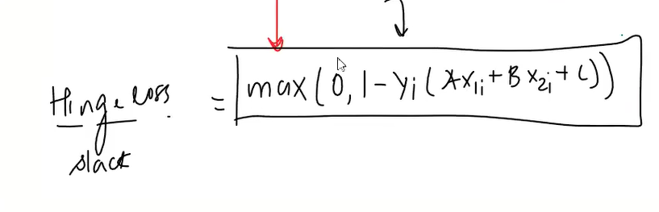
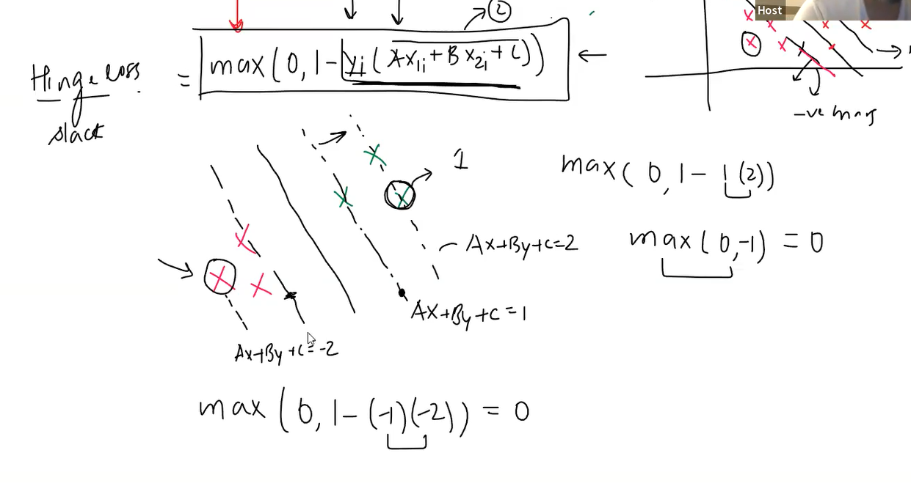

Types of SVM:

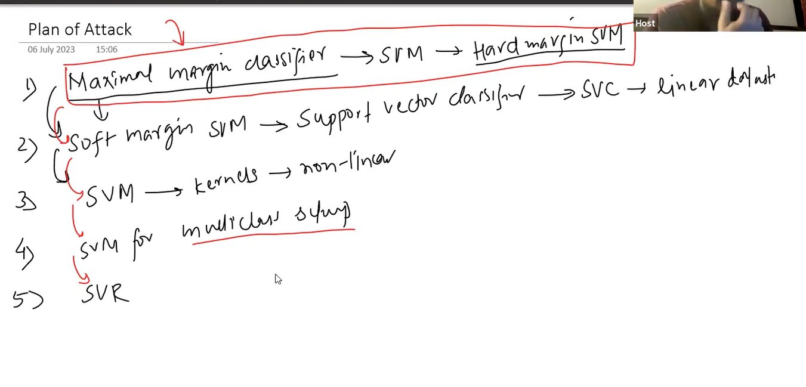

* Linear SVM : It is used when the data is linearly separable, meaning that a straight line (or hyperplane in higher dimensions) can be drawn to separate the classes. Linear SVM finds the optimal hyperplane that maximizes the margin between the two classes.
* Non-linear SVM : It is used when the data is not linearly separable. Non-linear SVM uses kernel functions to transform the data into a higher-dimensional space where it becomes linearly separable. Common kernel functions include polynomial, radial basis function (RBF), and sigmoid.
* Soft-margin SVM : It allows some misclassifications in the training data to create a more flexible decision boundary. Soft-margin SVM introduces slack variables to allow some data points to be on the wrong side of the hyperplane, while still maximizing the margin.
* Hard-margin SVM : It does not allow any misclassifications in the training data. Hard-margin SVM finds the optimal hyperplane that separates the classes with the maximum margin, but it may not generalize well to unseen data if the training data is noisy or contains outliers.
* Support Vector Regression (SVR) : It is an extension of SVM for regression tasks. SVR aims to find a function that approximates the relationship between the input features and the target variable, while allowing for some margin of error.
* One-Class SVM : It is used for anomaly detection or novelty detection tasks. One-Class SVM learns a decision boundary around the normal data points and identifies any data points that fall outside this boundary as anomalies.
* Nu-SVM : It is a variant of SVM that introduces a parameter (nu) to control the number of support vectors and the margin of the hyperplane. Nu-SVM allows for more flexibility in controlling the trade-off between maximizing the margin and minimizing the classification error.
* Least Squares SVM (LS-SVM) : It is a variant of SVM that uses least squares loss function instead of hinge loss. LS-SVM solves a set of linear equations to find the optimal hyperplane, which can be computationally more efficient than traditional SVM.
* Structured SVM : It is an extension of SVM for structured output prediction tasks, where the output variable is a complex structure (e.g., sequences, trees, graphs) rather than a single label. Structured SVM learns to predict the entire structure by considering the dependencies between the output variables.
* Multi-class SVM : It is an extension of SVM for multi-class classification tasks, where there are more than two classes. Multi-class SVM can be implemented using techniques like one-vs-one or one-vs-all, where multiple binary SVM classifiers are trained to distinguish between different pairs or groups of classes.
* Online SVM : It is a variant of SVM that can learn from streaming data or data that arrives in a sequential manner. Online SVM updates the model incrementally as new data points are received, allowing it to adapt to changing data distributions over time.
* Least Absolute Deviations SVM (LAD-SVM) : It is a variant of SVM that uses least absolute deviations loss function instead of hinge loss. LAD-SVM is more robust to outliers in the training data, as it minimizes the absolute differences between the predicted and actual values.
* Robust SVM : It is a variant of SVM that is designed to handle noisy or corrupted data. Robust SVM incorporates techniques like robust loss functions or outlier detection to improve the model's performance in the presence of noise or outliers.

The key concepts of SVM include:

* Hyperplane : It is a decision boundary that separates the data points of different classes. In a 2D space, it is a line, while in higher dimensions, it is a plane or a hyperplane.
* Support Vectors : These are the data points that are closest to the hyperplane and have the most influence on its position. They are the critical elements of the training set that determine the optimal hyperplane.
* Margin : It is the distance between the hyperplane and the nearest data points from each class (support vectors). SVM aims to maximize this margin to create a robust classifier.
* Kernel Trick : It is a technique used to transform non-linearly separable data into a higher-dimensional space where it becomes linearly separable. Common kernel functions include linear, polynomial, radial basis function (RBF), and sigmoid.
* Regularization : It is a technique used to prevent overfitting by adding a penalty term to the objective function. The regularization parameter (C) controls the trade-off between maximizing the margin and minimizing the classification error.
* Slack Variables : These are used in soft-margin SVM to allow some misclassifications in the training data. They help to create a more flexible decision boundary that can better generalize to unseen data.
* Dual Problem : SVM can be formulated as a dual optimization problem, which allows the use of kernel functions and makes the computation more efficient for high-dimensional data.
* Optimization Algorithms : SVM training involves solving a convex optimization problem. Common algorithms used for this purpose include Sequential Minimal Optimization (SMO) and gradient descent methods.
* Multi-class Classification : SVM is inherently a binary classifier, but it can be extended to handle multi-class classification problems using techniques like one-vs-one and one-vs-all.
* Probabilistic Outputs : SVM can be adapted to provide probabilistic outputs using methods like Platt scaling or isotonic regression, which can be useful for certain applications.
* Model Evaluation : SVM performance can be evaluated using metrics such as accuracy, precision, recall, F1-score, and ROC-AUC, depending on the specific classification task.
* Hyperparameter Tuning : SVM has several hyperparameters, such as the regularization parameter (C) and kernel parameters (e.g., gamma for RBF kernel), that can be tuned using techniques like grid search or random search to optimize model performance.
* Scalability : SVM can be computationally intensive for large datasets, so techniques like approximate SVM or using linear SVM implementations (e.g., LIBLINEAR) can help improve scalability.
* Applications : SVM is widely used in various applications, including text classification, image recognition, bioinformatics, and fraud detection, due to its effectiveness in handling high-dimensional data and complex decision boundaries.
* Interpretability : While SVMs are not as interpretable as some other models (e.g., decision trees), techniques like feature importance analysis and visualization of support vectors can provide insights into the model's decision-making process.
* Model Selection : Choosing the appropriate kernel function and hyperparameters is crucial for SVM performance. Cross-validation techniques can help in selecting the best model configuration.
* Handling Imbalanced Data : SVM can be sensitive to class imbalance. Techniques like adjusting class weights, oversampling the minority class, or undersampling the majority class can help improve performance on imbalanced datasets.
* Computational Complexity : The training time of SVM can be high, especially for large datasets, as it involves solving a quadratic programming problem. However, once trained, SVMs can make predictions relatively quickly.
* Robustness to Outliers : SVM can be sensitive to outliers, especially in the case of hard-margin SVM. Using soft-margin SVM with appropriate regularization can help mitigate the impact of outliers on the decision boundary.
* Model Persistence : SVM models can be saved and loaded using libraries like joblib or pickle in Python, allowing for easy deployment and reuse of trained models.
* Integration with Other Techniques : SVM can be combined with other machine learning techniques, such as ensemble methods or feature selection, to enhance model performance and interpretability.
* Software Implementations : SVM is implemented in various machine learning libraries, such as scikit-learn, LIBSVM, and TensorFlow, making it accessible for practitioners and researchers.
* Extensions : There are several extensions of SVM, such as Support Vector Regression (SVR) for regression tasks and One-Class SVM for anomaly detection.
* Limitations : SVM may not perform well on very large datasets or when the number of features is much larger than the number of samples. Additionally, SVMs can be less interpretable compared to simpler models like linear regression or decision trees.
* Hyperplane Optimization : The optimal hyperplane is determined by solving a convex optimization problem that maximizes the margin while minimizing classification errors. This is typically done using techniques like quadratic programming.
* Soft Margin vs. Hard Margin : SVM can be implemented with either a hard margin (no misclassifications allowed) or a soft margin (some misclassifications allowed). Soft margin SVM is more flexible and can handle noisy data better.
* Feature Scaling : SVM is sensitive to the scale of the input features. Therefore, it is important to standardize or normalize the features before training the model to ensure that all features contribute equally to the distance calculations.
* Model Complexity : The choice of kernel and hyperparameters can significantly affect the complexity of the SVM model. A more complex model may fit the training data better but can also lead to overfitting.
* Cross-Validation : To assess the performance of an SVM model and tune hyperparameters, cross-validation techniques such as k-fold cross-validation can be employed. This helps in obtaining a more reliable estimate of the model's generalization performance.
* Computational Efficiency : For large datasets, training SVMs can be computationally expensive. Techniques like using linear SVMs or approximate methods can help improve efficiency without significantly compromising performance.
* Applications in Various Domains : SVM has been successfully applied in various domains, including text classification (e.g., spam detection), image recognition (e.g., face detection), bioinformatics (e.g., protein classification), and finance (e.g., credit risk assessment).
* Interpretation of Support Vectors : The support vectors are the critical data points that define the decision boundary. Analyzing these points can provide insights into the model's behavior and the characteristics of the data.
* Multi-class SVM Strategies : Since SVM is inherently a binary classifier, strategies like one-vs-one (OvO) and one-vs-all (OvA) are used to extend SVM for multi-class classification problems. OvO involves training a separate SVM for each pair of classes, while OvA involves training an SVM for each class against all other classes.
* Probability Estimates : Although SVMs do not inherently provide probability estimates, techniques like Platt scaling or isotonic regression can be used to convert SVM outputs into calibrated probabilities, which can be useful for certain applications.
* Feature Selection : SVM can be used for feature selection by analyzing the weights assigned to features in the decision function. Features with higher weights are considered more important for classification.
* Handling Noisy Data : SVM can be sensitive to noisy data points. Using techniques like soft-margin SVM and appropriate regularization can help improve robustness to noise.
* Model Deployment : SVM models can be deployed in production environments using various frameworks and libraries, allowing for real-time predictions and integration with other systems.
* Continuous Learning : SVM can be adapted for online learning scenarios, where the model is updated incrementally as new data becomes available, allowing it to adapt to changing data distributions over time.
* Research and Advancements : Ongoing research in the field of SVM continues to explore new kernel functions, optimization techniques, and applications, contributing to the evolution of this powerful machine learning algorithm.

## There are mainly 2 types of ML Models

**Parametric Models :** In parametric models, the model structure is defined by a fixed number of parameters. Once these parameters are learned from the training data, the model can make predictions without needing to refer back to the entire dataset. Examples of parametric models include linear regression, logistic regression, and neural networks.

* Parametric models make strong assumptions about the data, such as assuming a specific functional form (e.g., linearity) or data distribution (e.g., Gaussian,linear). This can lead to underfitting if the assumptions do not hold true for the data.
* Fixed number of parameters regardless of the size of the training data. This can lead to faster training and prediction times, especially for large datasets.
  
**Non-Parametric Models :** Non-parametric models do not assume a fixed number of parameters. Instead, they can adapt their complexity based on the amount of training data available. These models often require storing the entire dataset or a significant portion of it to make predictions. Examples of non-parametric models include k-nearest neighbors (KNN), decision trees, and kernel density estimation.

What is residual error?
Residual error, also known as residuals or prediction errors, refers to the difference between the observed (actual) values and the predicted values generated by a regression model. In other words, it quantifies how much the model's predictions deviate from the true values in the dataset. It is combination of both reducible and irreducible error.

